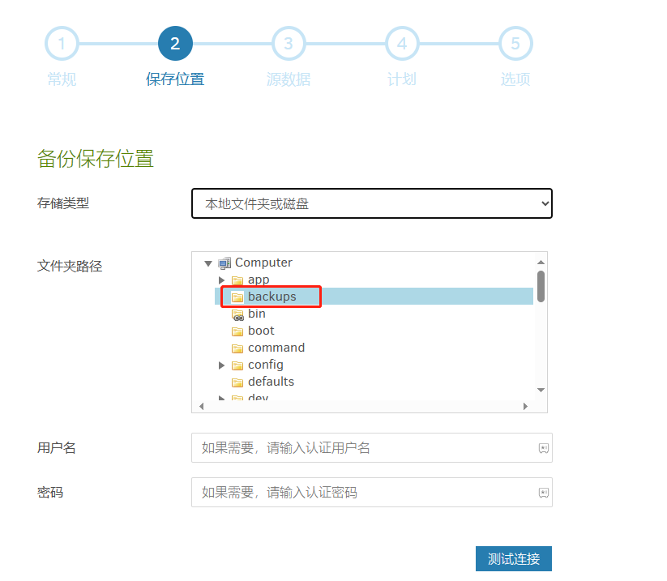
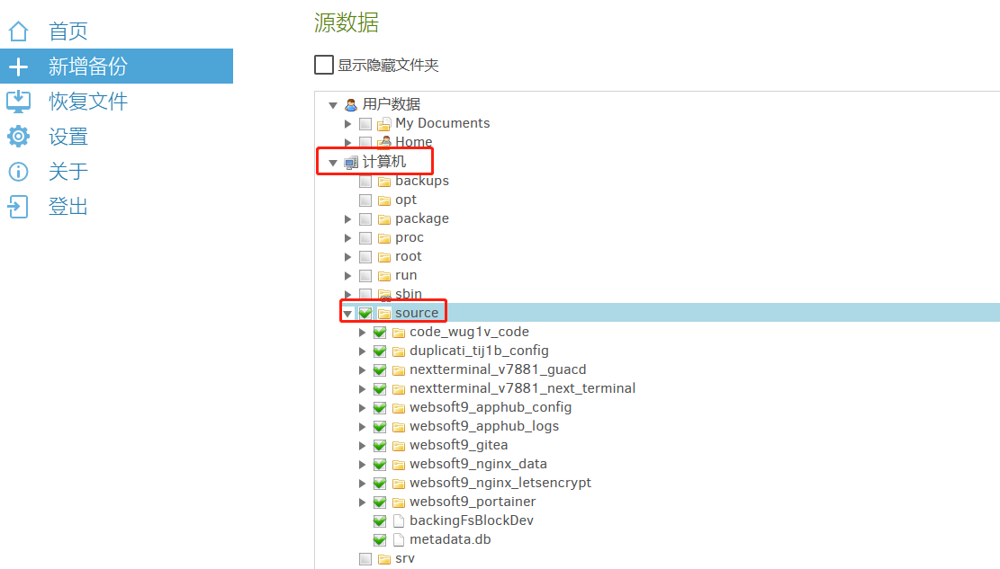

# Websoft9 以及应用备份

由于 Websoft9 完全基于 Docker，故一旦备份了 Websoft9 以及应用程序的 Docker volumes，那么就实现了全部数据的备份。  

## 备份/恢复 Volumes（推荐）

### 备份

Websoft9 以及应用的可视化 Volumes 备份（回复）功能，主要通过安装一个名称 **Duplicati** 的应用来实现： 

下面详细如何备份 Websoft9 以及应用程序的 Volumes：

1. 通过 Websoft9 控制台的【应用商店】，找到 **Duplicati**，并以默认方式安装它

2. 访问 **Duplicati** 的控制台界面，通过【设置】>【访问控制】设置一个管理员密码

3. 点击【新增备份】，选择【配置新备份】开始创建，进入常规设置：

   - 名称：任意填写
   - 加密方式：可选择 **无密码**

4. 设置保存位置，即备份到哪个地方。Duplicati 支持本地和远程数十种备份模式。

   - 存储路径选择 **本地文件夹或磁盘**，文件夹路径设置为： 【Computer】>【backups】  
     备份会直接保存到服务器目录 */data/websoft9/vl_backups*（它是 Duplicati 容器挂载的备份目录）  

     

   - 存储路径选择 **SFTP**，支持保存到 Websoft9 所在的服务器或第三方服务器

   - 存储路径选择 **其他**，主要是保存到其他位置

5. 设置源数据，即备份对象。请点击【计算机】>【Source】列出可备份的 Volumes

   
   
   - 以 websoft9_ 开头的文件夹，是 Websoft9 自身的数据目录
   - 其他文件夹是应用目录

6. 设置备份的计划任务

7. 设置其他选型

8. 设置完成后，可立即运行备份
   

### 恢复

Duplicati 可以很方便的恢复备份。需要注意的恢复时，务必勾选**恢复读写权限**。

## 其他备份方式

除备份 Volumes 之外，用户也可以通过更加 **原生** 的方式对应用程序进行其他方式的备份

### 应用自带的备份工具

部分应用程序自身会提供自动备份工具（CLI 或 可视化界面）帮助用户实现有计划的自动备份。  

具体参考应用程序相关的章节。 

### 手工导出

手动导出是一种最原始的备份方法，它无法做到自动备份，但简单有效：  

1. 在服务器上将 [目标 Volumes](../admin/parameter) **压缩后再下载** 到本地或服务器其他路径

2. 通过[数据库管理工具](../guide/appdb)导出数据库

3. 将程序文件和数据库文件放到同一个文件夹，根据日期命名

4. 备份工作完成