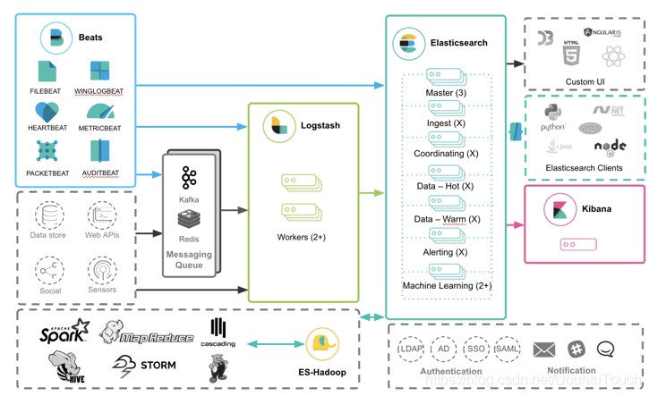

import Meta from './_include/elasticsearch.md';

<Meta name="meta" />

## 入门指南{#guide}

### 初始化{#wizard}

Websoft9 控制台安装 Elasticsearch 后，通过 "我的应用" 查看应用详情，在 "访问" 标签页中获取登录信息。  

1. 使用本地电脑浏览器访问，进入 Elasticsearch API 认证提示

2. 输入用户名（elastic）和密码，成功后会输出 API 基本信息

### 获取 Enrollment Token{#token}

Enrollment Token 是用于 Kibana 除此连接的必要信息。可以在 Elasticsearch 中运行重置命令获取：

```
/usr/share/elasticsearch/bin/elasticsearch-create-enrollment-token -s kibana
```

### 使用 Kibana 管理{#kibaba}

Elasticsearch 应用中默认不含 [Kibana](./kibana)，用户可以通过 Websoft9 **应用商店** 安装 Kibana。    

### 连接 Logstash 并分析{#logstash}

[Logstash](./logstash) 是数据的采集、加工和传输管道，它是如何与 Elasticsearch 配套工作的呢？

1. 编辑 Logstash 配置文件

2. 新增一个 pipeline 的配置文件（**output** 段需填写准确的 ES 账号），其内容如下：
   ```
   input{
      file{
         path => "/var/log/*.log"
         type => "elasticsearch"
         start_position => "beginning"
      }
   }

   ## Add your filters / logstash plugins configuration here

   output {
      elasticsearch {
         hosts => "elasticsearch:9200"
         user => "elastic"
         password => "elastic123"
                  index => "mytest"
      }
   }
   ```

3. 运行命令 `curl http://URL/cat/indices?v` 验证 Elasticsearch 和 Logstash 的连接，索引是否生效

4. 登陆 Kibana，点击【Manage】，创建一个【Index Patterns】

5. 根据提示完成创建任务，最后用 **时间戳** 检索数据

## 配置选项{#configs}

- 默认管理员账号：elastic
- [Elasticsearch API](https://www.elastic.co/guide/en/elasticsearch/reference/current/http-clients.html)
- 多语言（✅）：Kibana 配置文件中增加 `i18n.locale: "zh-CN"`
- 开源许可：[ELASTIC-LICENSE](https://github.com/elastic/elasticsearch/blob/master/licenses/ELASTIC-LICENSE-2.0.txt)
- SMTP（√）

## 管理维护{#administrator}

- [Email 配置](https://www.elastic.co/guide/en/elasticsearch/reference/current/actions-email.html)：Kibana 控制台，依次打开：【Stack Management】>【Watcher】，增加一个 [Email Action](https://www.elastic.co/guide/en/elasticsearch/reference/current/actions.html)

- 重置密码：ElasticSearch 容器中运行命令 `/usr/share/elasticsearch/bin/elasticsearch-reset-password -u elastic`

- 备份与恢复：Elastic 内置快照[备份功能](https://www.elastic.co/guide/en/elasticsearch/reference/7.13/snapshot-restore.html)

## 问题与故障

#### ERROR: exit code 137？

错误详情：ERROR: Elasticsearch exited unexpectedly, with exit code 137    
问题原因：启动或运行时，服务器可分配给 ES 的内存不足   

实践发现可用内存超过 1G 时，此 ERROR 还不会出现   

#### Logstash 无法输出到 ES？

检查 Logstash 的 pipeline 配置文件中 Elasticsearch 账号密码是否正确

#### TOO_MANY_REQUESTS ... disk usage？

如果现实下面的错误信息，即表明磁盘空间不足。  
```
kibana_task_manager_7.17.4_001/_mapping?timeout=60s error: [cluster_block_exception]: index [.kibana_task_manager_7.17.4_001] blocked by: [TOO_MANY_REQUESTS/12/disk usage exceeded flood-stage watermark, index has read-only-allow-delete block];,"}
```

ES 对磁盘空间有较高的要求，建议准备足够的空间。 

#### Elastic 具体包含哪些应用？

“Elastic Stack” 是三个开源项目的缩写：Elasticsearch，Logstash 和 Kibana。

- Elasticsearch 是一个存储数据和检索数据等数据库
- Logstash 是数据提取、清洗和整理的中间件
- Kibana 是 Elasticsearch 的可视化管理分析界面，Kibana 依赖 Elasticsearch

另外，随着 Elastic 公司不断发展，他们把更多的产品加入到了 ELK 家族，例如：一个日志采集工具 Beats

下面是 Elastic Stack 用于日志场景的典型架构图



#### Elasticsearch 全部免费吗？

Elasticsearch 由之前的开源版+商业扩展包 xpack 组成。其中 xpack 基本功能免费，需要使用全部功能可以向官方申请 30 天的免费试用期，试用期结束后回归到基本功能或订阅。  
