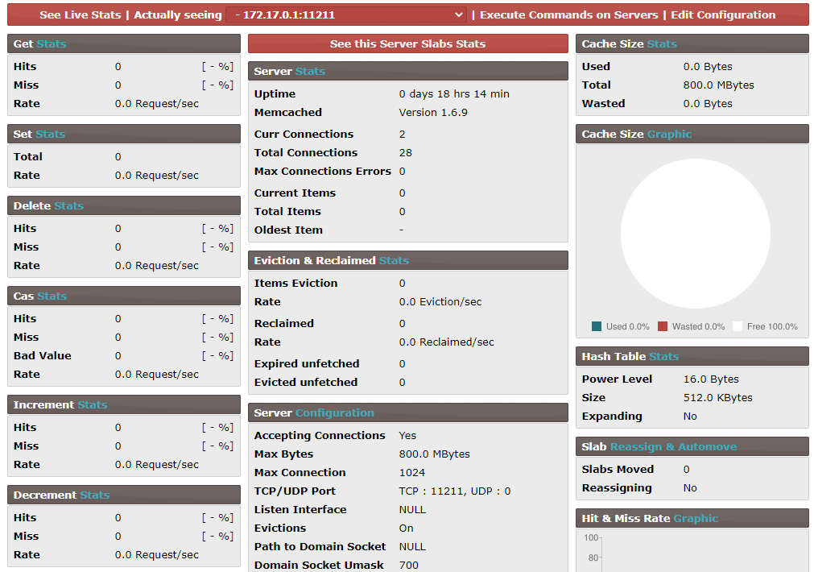

import Meta from './_include/memcached.md';

<Meta name="meta" />

## 入门指南{#guide}

Websoft9 控制台安装 Memcached 后，通过 "我的应用" 查看应用详情，在 "访问" 标签页中获取登录信息。

### 登录管理端

本应用编排中预制 **Memcached-admin** ，但默认没有启用。如果需要启用，请参考下面的步骤：

1. Websoft9 控制台 Memcached 应用管理的编排页面

2. 修改 Memcached 的 docker-compose.yml 文件

   - ports 中的宿主机端口
   - 删除 profiles 指令

3. 重建应用后，本地浏览器访问 http://URL:port，进入控制面板
  

### Telnet 连接

1. 运行 telnet 命令，连接 Memcached

   ```
   telnet 127.0.0.1 11211
   Trying 127.0.0.1...
   Connected to 127.0.0.1.
   Escape character is '^]'.
   ```

3. 连接成功，系统进入 Memcached 命令行输入状态，输入命令 `stats`

   ```
   $ stats
   STAT pid 651
   STAT uptime 891
   STAT time 1585225158
   STAT version 1.4.15
   STAT libevent 2.0.21-stable
   ...
   ```
   
## 配置选项{#configs}

- 客户端命令：[Memcached Commands](https://github.com/memcached/memcached/wiki/Commands) 是通过 Telnet 来运行的
- 服务端命令：`memcached -h`
- Memcached-admin：需要修改编排文件启用它

## 管理维护{#administrator}

## 故障