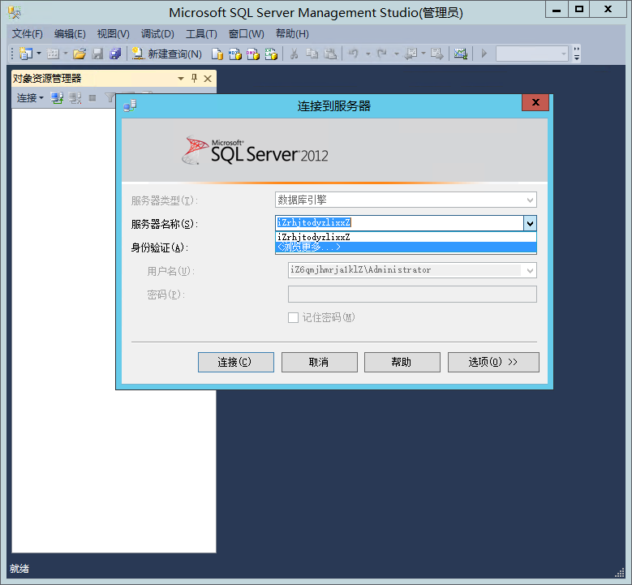
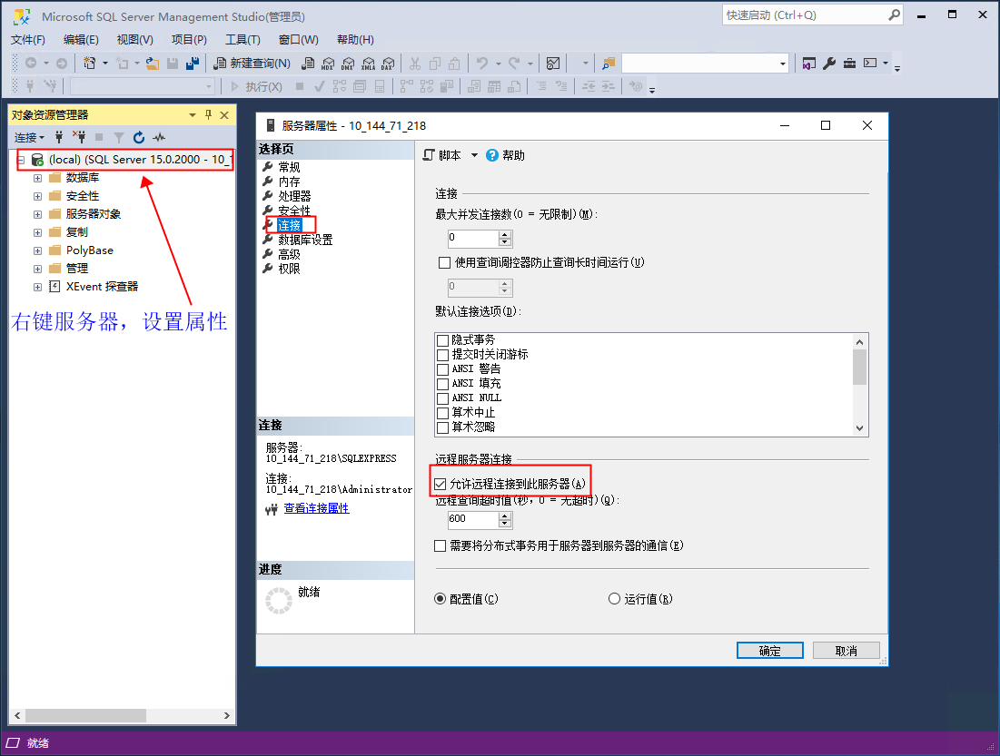
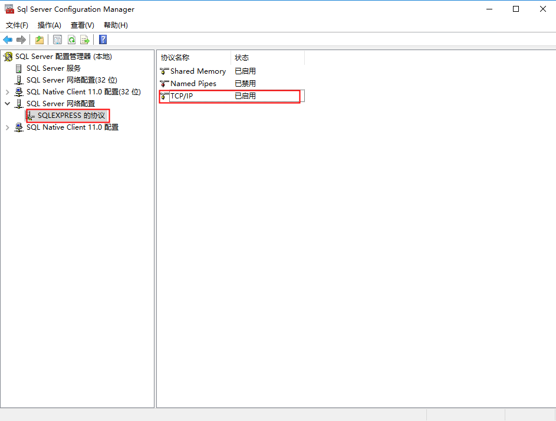
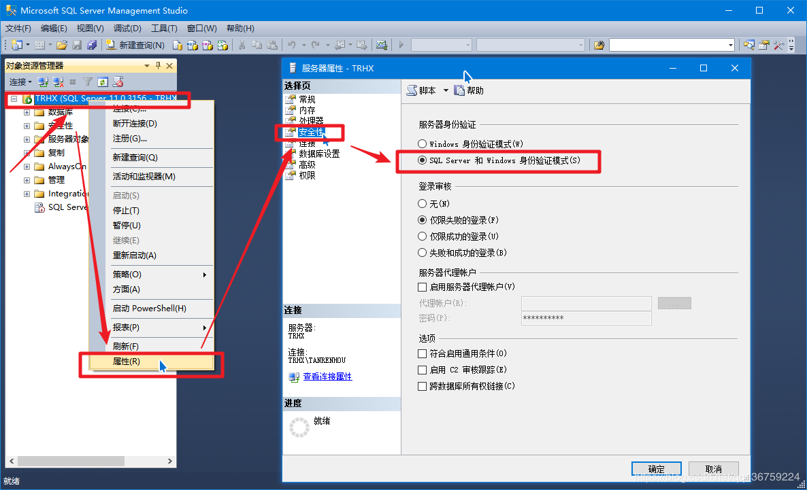
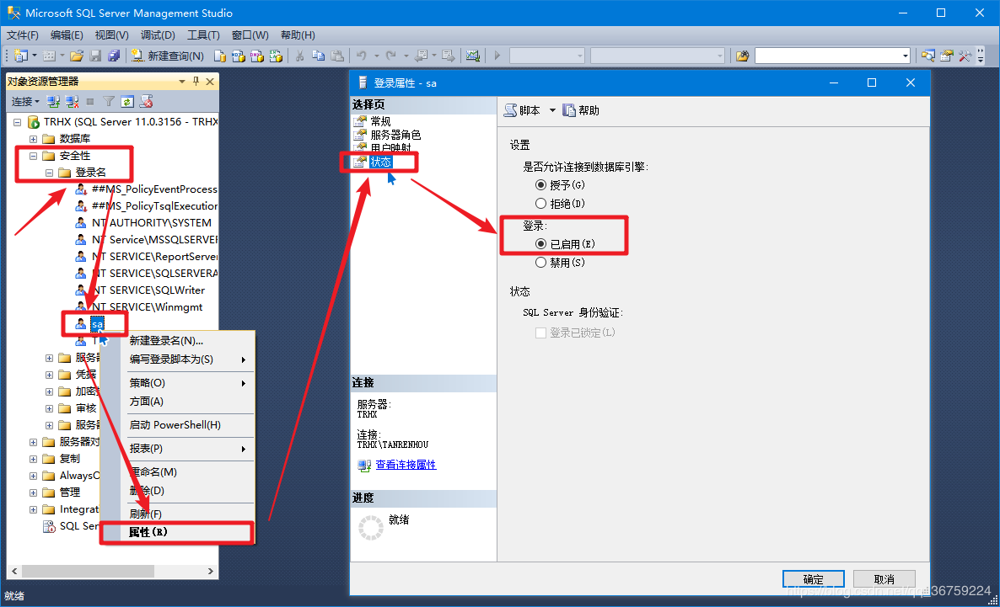
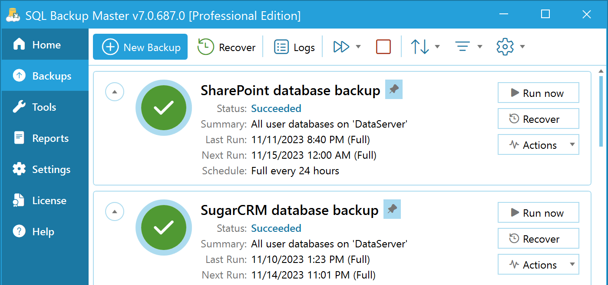

import Tabs from '@theme/Tabs';
import TabItem from '@theme/TabItem';

import Meta from './_include/sqlserver.md';

<Meta name="meta" />

### 知识产权申明{#license}

本文档中所涉及的 SQLServer 均为 Express 版本，可以免费使用或分发[（详情条款）](https://www.microsoft.com/zh-cn/download/details.aspx?id=29693)

- Windows 服务器适用于： SQL Server Express 2005, 2008, 2012, 2014, 2016, 2017
- Linux 服务器适用于： SQL Server Express 2017 2019 2022

产品 License 清单： 

* [license_Expr_2005.rtf](./assets/license/license_Expr_2005.rtf)
* [license_Expr_2008R2.rtf](./assets/license/license_Expr_2008R2.rtf)
* [license_Expr_2008.rtf](./assets/license/license_Expr_2008.rtf)
* [license_Expr_2012.rtf](./assets/license/license_Expr_2012.rtf)

Express版本与企业版相比，功能更少（例：[SQLServer 2016 各个版本功能对比](https://docs.microsoft.com/zh-cn/sql/sql-server/editions-and-components-of-sql-server-2016?view=sql-server-ver15#Cross-BoxScaleLimits)）。  

另外，它针对服务器有如下的限制：不超过1个处理器，不超过10G数据存储

## 入门指南{#guide}

### 企业管理器连接

1. 使用本地电脑的 **远程桌面**工具，登录到服务器 
2. 获取服务器名称："我的电脑" > "属性" 中的计算机名即服务器名称
3. 打开 **SQLServer企业管理器**，填写服务器名称，并以 "Windows身份验证" 登录数据库  

   - 服务器名称：填写为 `.` 或 `(local)` 或上一步获取的名称，也可以点击 **浏览更多...** 获取
   - 身份验证：选择 "Windows身份验证"
     

### 客户端远程连接

Windows 和 Linux 下安装的 SQL Server，只要服务器端允许，都可以通过客户端工具，远程连接数据库：

1. 通过 Websoft9 应用商店，安装通用的数据库管理工具 [CloudBeaver](./cloudbeaver)

2. 登录 CloudBeaver，新建一个 SQL Server 连接

也可以在本地电脑安装 Navicat 等工具管理数据库。  

### 启用远程访问{#remote}

访问 Windows 下的 SQL Server 数据库，需分别对 SQL Server 和 Windows 系统做出与远程访问相关的设置： 

#### SQLServer 服务端{#remotess}

1. 打开**SQLServer企业管理器**工具，在服务器【连接】属性中，勾选【允许远程连接到本服务器】
   
   
2. 打开**SQL Server 配置管理器**工具，在网络配置中，启用【TCP/IP】协议
   

#### Windows 系统端{#remotefirewall}
   
1. Windows 系统中的 "Windows防火墙"，为 SQL Server 配置防火墙 **允许** 策略  

2. 在云控制台中，开启服务器安全组的**1433端口**  

### 启用 sa 密码{#enablepw}

Windows 下的 SQL Server 启用 sa 密码的步骤：

1. SQL Server 企业管理器："属性" > "安全性"，勾选 **SQLServer 和 Windows 身份验证模式(s)**  
   

2. SQL Server 企业管理器 "安全性" > "登陆名" 菜单下，右键打开 `sa` 账号的属性，设置 sa 的密码
   

3. 重启 SQL Server 服务后生效

## 配置选项{#configs}

- 路径 on Linux

  - 数据目录（已挂载）：*/var/opt/mssql*

- 路径 on Windows

   * 安装目录： C:\Program Files\Microsoft SQL Server
   * 数据目录：C:\Program Files (x86)\Microsoft SQL Server\MSSQL12.MSSQLSERVER\MSSQL\DATA

- 服务管理 on Windows

  - Windows 菜单打开 **SQL Server 配置管理器**，启动或重启 SQL Server 服务
  -  net start｜stop mssqlserver

- 命令行：[mssql-cli](https://docs.microsoft.com/en-us/sql/tools/mssql-cli)

- 更换数据库路径：SQL Server 企业管理器 "属性" 下，打开 "数据库设置" 标签页下的 “数据库默认位置”

- [Express 升级到 SQL Server 的其他版本](https://docs.microsoft.com/zh-cn/sql/database-engine/install-windows/upgrade-to-a-different-edition-of-sql-server-setup?view=sql-server-ver15)

## 管理维护{#administrator}

### 手动备份{#backup}

通用的手动备份操作步骤如下：

1. SQL Server企业管理器：右键点击目标数据库，选择 "任务" > "备份"，弹出备份数据库窗口。 

2. 根据备份向导逐步完成备份工作

### 自动备份{#autobackup}

SQL Server Express 没有 SQL Server Agent 服务，即无法直接使用 SQL Server 自带的自动备份功能。  

但是，仍然有被广泛使用的备选的自动备份方案：

- 使用 [SQL Backup Master](https://www.sqlbackupmaster.com/) 这个专业的免费备份工具（推荐）
  

- 编写备份脚本，然后放到 Windows 系统的计划任务中运行

## 故障

#### 无法使用 SQLServer 密码登录？

参考：[启用密码](#enablepw)

#### SQLServer 本地连接失败？

请检查服务器名称是否正确：在【服务器名称】中通过【浏览更多...】选择正确的服务器

#### 备份失败：确保正确的介质...？

问题原因：这个不是数据库自身的故障，而是备份的用法有问题。  
解决办法：去掉一个备份文件，每次备份在已有备份中覆盖即可