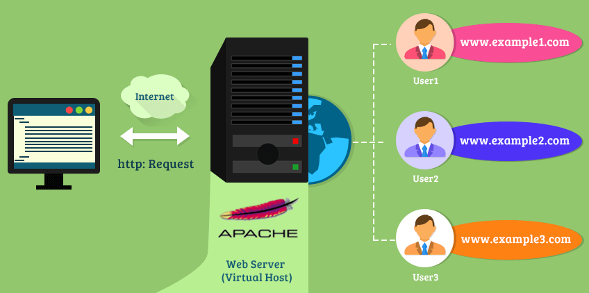
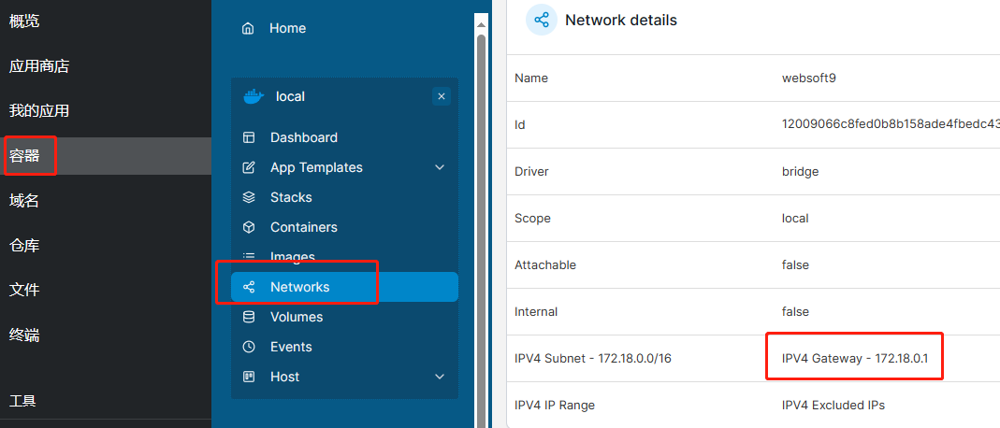

# 为应用设置 Proxy 访问



## 设置 HTTP 转发{#http}

Proxy Host 即一个实现代理转发的**虚拟主机**，它可以将一个运行在服务器或容器内部的应用，通过 Nginx 虚拟主机的 proxy 功能，把应用绑定到域名发布出去，供 Internet 用户访问。  

### 基本设置

1. 控制台依次打开：【网关】>【Hosts】>【Proxy Hosts】项

2. 点击【Add Proxy Host】，注意重要信息的填写：

   - Domain Names: 一个或多个域名

   - Scheme：应用被代理之前的访问的协议（一般都是 HTTP）

   - Forward Port
      
     - 容器类应用填写容器端口
     - 非容器类应用填写服务器端口

   - Forward Hostname / IP：应用当前可以访问的地址。
     - 容器应用，填写容器名称（container_name）
     - 非容器应用，打开 Websoft9 控制台，通过：【容器】>【Networks】，查看 websoft9 网络的 IPV4 Gateway
       

### Proxy Host 的 Advanced 设置{#proxy-advanced}

Advanced 是一个 server 级作用域（非 location / 作用域），但可以自定义 location / 覆盖默认值

下面是一个可以覆盖默认 location / 的全局设置：  

```
location / {
        add_header       X-Served-By $host;
        proxy_set_header Host $host;
        proxy_set_header X-Forwarded-Scheme $scheme;
        proxy_set_header X-Forwarded-Proto  $scheme;
        proxy_set_header X-Forwarded-For    $proxy_add_x_forwarded_for;
        proxy_set_header X-Real-IP          $remote_addr;
        proxy_pass       $forward_scheme://$server:$port$request_uri;
        proxy_set_header Upgrade $http_upgrade;
        proxy_set_header Connection upgrade;
    }
```

### Proxy Host 增加 Location 指令{#proxy-location}

直接把指令的内容（参考下面的模板）复制到设置框（通过 location 【齿轮】图标打开）

```
proxy_pass http://$server:8080; 
proxy_http_version 1.1;
proxy_set_header Host $http_host;
proxy_set_header X-Real-IP $remote_addr;
proxy_set_header X-Forwarded-For $proxy_add_x_forwarded_for;
proxy_set_header X-Forwarded-Proto $scheme;
```

### 为 Proxy Host 设置 HTTPS

Websoft9 的网关支持自动证书和上传证书两种类型，具体参考：[HTTPS 设置指南](../guide/appsethttps)

### 应用安全访问控制{#access-auth}

Websoft9 的网关支持密码和白名单等访问控制，具体参考：[应用安全访问控制指南](../guide/appauth)

## 设置 TCP/UDP 转发{#stream}

网关的 **Streams** 功能可以设置 TCP/UDP 端口转发，非常合适数据库这种期望临时开启外网访问的应用：  

1. 控制台依次打开：【网关】>【Hosts】>【Streams】项

2. 填写好 Incoming Port 以及被转发的 Forward Host 和 Forward Port
