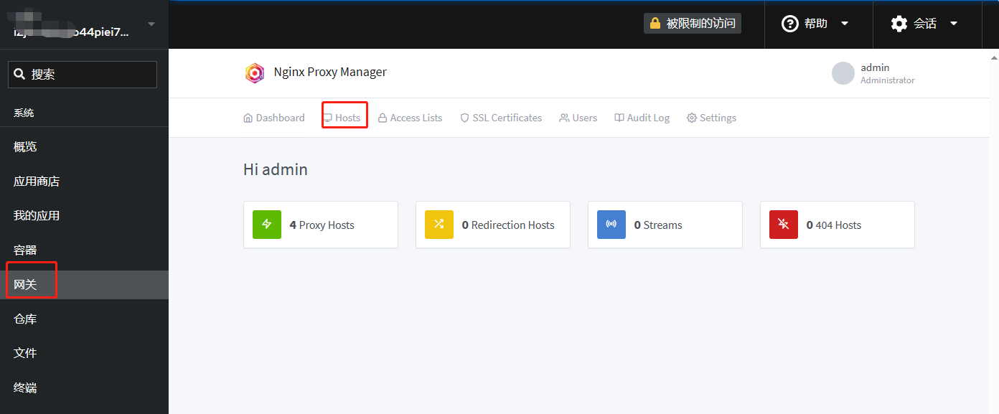

import DocCardList from '@theme/DocCardList';
import {useCurrentSidebarCategory} from '@docusaurus/theme-common';

# 设置域名与安全访问

所有的企业级应用部署，都会采用 HTTP 网关发布应用，控制应用的安全访问。   

Websoft9 内置 Nginx Proxy Manager（简称 [NPM](https://nginxproxymanager.com/guide/)） 作为**应用程序网关**，并 100% 保持其原生性和独立开放性。  



它以 Proxy 代理作为核心功能基础，核心的功能包括：

- HTTP 反向代理
- TCP/UDP 端口转发
- 404 重定向
- 自动化的 SSL 证书申请与续期
- 访问控制与白名单

## 工作原理

此处不介绍网关的自身的功能原理，只阐述一个问题：

**网关是如何与 Websoft9 应用商店进行协作的？**     

当用户通过 Websoft9 应用商店安装的程序，应用管理器会调用网关的 API 接口，基于接口自动创建域名绑定到容器端口，帮助程序实现 **域名** 访问。 依次类推，修改域名、删除应用等操作，都会调用网关的 API 接口，完成所需的操作。 

网关需具备一定的 HTTP 服务应用经验的用户使用，否则很容易破坏已安装应用的访问。 

## 使用指南

<DocCardList items={useCurrentSidebarCategory().items}/>

## 常用功能

[NPM 官方文档](https://nginxproxymanager.com/guide/) 很全面的介绍了它的使用和配置，下面我结合一些配置场景进行更灵活的运用：

### 增加 Proxy Host{#add-proxhost}

Proxy Host 即一个实现代理转发的**虚拟主机**，它可以将一个运行在服务器或容器内部的应用，通过 Nginx 虚拟主机的 proxy 功能，把应用绑定到域名发布出去，供 Internet 用户访问。  

1. 控制台依次打开：【网关】>【Hosts】>【Proxy Hosts】项

2. 点击【Add Proxy Host】，注意重要信息的填写：

   - Domain Names: 一个或多个域名

   - Scheme：应用被代理之前的访问的协议（一般都是 HTTP）

   - Forward Port
      
     - 容器类应用填写容器端口
     - 非容器类应用填写服务器端口

   - Forward Hostname / IP：应用当前可以访问的地址。
     - 容器应用，填写容器名称（container_name）
     - 非容器应用，打开 Websoft9 控制台，通过：【容器】>【Networks】，查看 websoft9 网络的 IPV4 Gateway
       

3. 根据实际情况设置 [Custom location](./gateway##proxy-location) 或 [Advanced](./gateway#proxy-advanced) 覆盖设置默认的 **location /**

### 配置 HTTPS 证书{#sethttps}

Websoft9 的网关支持自动证书和上传证书两种类型，具体参考：[HTTP 设置指南](../guide/appsethttps)

### 应用安全访问控制{#access-auth}

Websoft9 的网关支持密码和白名单等访问控制，具体参考：[应用安全访问控制指南](../guide/appauth)

### 转发 TCP/UDP 端口{#tcp-forward}

网关的 **Streams** 功能可以设置 TCP/UDP 端口转发，非常合适数据库这种期望临时开启外网访问的应用：  

1. 控制台依次打开：【网关】>【Hosts】>【Streams】项

2. 填写好 Incoming Port 以及被转发的 Forward Host 和 Forward Port

### Proxy Host 的 Advanced 设置{#proxy-advanced}

Advanced 是一个 server 级作用域（非 location / 作用域），但可以自定义 location / 覆盖默认值

下面是一个可以覆盖默认 location / 的全局设置：  

```
location / {
        add_header       X-Served-By $host;
        proxy_set_header Host $host;
        proxy_set_header X-Forwarded-Scheme $scheme;
        proxy_set_header X-Forwarded-Proto  $scheme;
        proxy_set_header X-Forwarded-For    $proxy_add_x_forwarded_for;
        proxy_set_header X-Real-IP          $remote_addr;
        proxy_pass       $forward_scheme://$server:$port$request_uri;
        proxy_set_header Upgrade $http_upgrade;
        proxy_set_header Connection upgrade;
    }
```

### Proxy Host 增加 Location 指令{#proxy-location}

直接把指令的内容（参考下面的模板）复制到设置框（通过 location 【齿轮】图标打开）

```
proxy_pass http://$server:8080; 
proxy_http_version 1.1;
proxy_set_header Host $http_host;
proxy_set_header X-Real-IP $remote_addr;
proxy_set_header X-Forwarded-For $proxy_add_x_forwarded_for;
proxy_set_header X-Forwarded-Proto $scheme;
```

### 静态网站支持

把网关当做应用程序服务器，在网关容器中上传静态网站内容这种静态网站发布方式是不建议的。  

推荐的方式是：

1. 先运行一个静态网站容器，并将静态网站源码与容器绑定

2. 通过网关将静态网站端口访问发布出来


## 常见问题

#### 用户可以自行修改网关邮件地址吗？

目前不可以，修改后会导致程序异常

#### IP 地址的 Proxy 是否可以设置 HTTPS？

不可以


