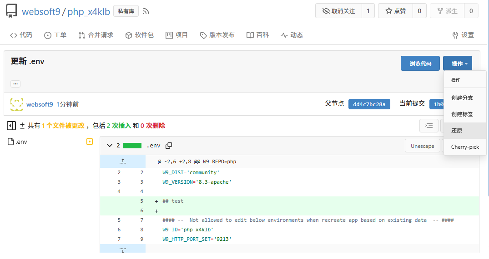

# 使用 Git 管理自动化部署代码

Websoft9 遵循 [GitOps](https://about.gitlab.com/topics/gitops/) 思想，使用 Git 管理自动化部署代码。这样使得部署过程更加透明、可追溯、协作和安全，同时提供了强大的工具来支持自动化和集成，这对于现代软件开发和运维实践至关重要。

## 使用 Git 带来的好处{#whygit}

使用 Git 管理部署代码，通常称为基础设施即代码，Infrastructure as Code，它带来的好处显而易见：

1. **版本控制**：Git 强大的版本控制能力允许你跟踪和记录部署代码的每一次更改。

2. **团队协作**：Git 支持多个开发者协同工作，通过分支、请求、审查管理部署代码，从而提高代码质量并减少部署错误。

3. **回滚能力**：如果新的部署代码引入了问题，Git 允许你轻松地回滚到之前的状态。这种快速回滚能力在生产环境中至关重要。

4. **自动化和集成**：Git 可以与持续集成/持续部署（CI/CD）工具链紧密集成，实现自动触发流程，加速整个软件交付。

5. **审计和合规**：Git 提供了一个不可变的历史记录，满足审计要求和合规性检查。

6. **一致性和标准化**：使用 Git 确保所有环境（开发、测试、生产）使用相同的部署代码，减少环境之间的差异带来的问题。

7. **安全性**：Git 仓库可以配置访问控制和权限，防止在服务器上未授权的更改导致的风险操作。

总结来说，使用 Git 管理自部署代码 vs 在服务器直接管理部署代码，前者无疑是更科学的选择。  

## 平台内置 Gitea 作为 Git 管理工具{#gitea}

Websoft9 控制台集成 [Gitea](https://gitea.com) 作为 Git 自动化部署代码的存储平台，并 100% 保持其原生性。   

[Gitea](https://docs.gitea.com/)  是一个开源的自托管Git服务，它是用 Go 语言编写的。它旨在提供一个简单、轻量级和可扩展的方式来设置你自己的 Git 服务。它提供了一个简洁的用户界面，使得用户可以轻松地浏览仓库、提交、分支和更多功能。

## 平台的 Git 部署逻辑{#process}

Websoft9 使用 Git 部署逻辑实际上非常简单，它只有四个步骤：

1. 准备好云服务器

2. 准备好 Docker 镜像或源码包等**制品部署物**

3. 增加一个 Git 仓库，其中包含自动化的部署编排和配置脚本的

4. 主动或触发式将仓库代码推送到云服务器上执行，就开启了部署过程

## 自动创建 Git 仓库{#auto}

当用户通过 Websoft9 应用商店部署应用时，平台会为每个应用自动创建对应的 Git 仓库，并将应用的部署代码同步到仓库中。  

## 手动创建 Git 仓库{#create}

Gitea 支持用户手工创建仓库:

1. 登录 Websoft9 控制台，点击左侧 "仓库" 菜单，进入仓库功能页面

2. 点击仓库页面的右上角 "+"，创建一个仓库
   

3. 仓库创建页面中，两个需要重点注意的设置项

   - 拥有者：建议选择[自行增加的仓库用户](#user)
   - 可见性：私有或公有

4. 确认设置项无误后，点击 "创建仓库"

5. 仓库创建成功后，可以用于存放部署所需的源码包，也可以管理 Issue

## 增加 Git 用户{#user}

Git 仓库默认用户 `websoft9` 主要用于模板化自动部署，故建议增加新的 Git 用户，以用于其他部署场景

1. 登录 Websoft9 控制台，进入仓库管理界面

2. 在仓库管理界面中，点击左侧 "个人信息与设置" 菜单，进入 **管理后台** 设置界面

3. 依次打开："身份及认证" > "账户管理" 页面，创建新账号
   

## 管理 Git 仓库{#manage}

Gitea 对仓库提供了全面的操作，包括：设置公开或私有、授权用户访问、Issue 管理、分支管理等  

## 修改和还原 Git 仓库的文件{#modify}

编辑和修改 Git 仓库的文件，是 Websoft9 持续部署的关键因素，常见的操作有：

- 修改文件内容
- 上传文件
- 获取下载地址
- 还原历史文件

下面介绍通过 Gitea 编辑和复原历史文件的通用步骤：  

1. 登录 Websoft9 控制台，进入仓库管理界面

2. 在仓库列表页面，打开一个所需修改的仓库

3. 点击进入任何一个文件详情，便可以对它进行增删改查等操作、
   

4. 进入文件的历史版本，可以方便的进行还原操作
   

## 相关参考

- [Gitea 官方文档](https://docs.gitea.com/zh-cn/)
- [gitops.tech](https://www.gitops.tech)
- [A beginner's guide to GitOps and how it works- GitLab](https://page.gitlab.com/resources-ebook-beginner-guide-gitops.html)
- [What is GitOps - Red Hat](https://www.redhat.com/en/topics/devops/what-is-gitops)
- [Is GitOps the next big thing in DevOps? - Atlassian](https://www.atlassian.com/git/tutorials/gitops)
- [What is GitOps: The Beginner's Guide - Splunk](https://www.splunk.com/en_us/blog/learn/gitops.html)
- [What is GitOps? - DigitalOcean](https://www.digitalocean.com/blog/what-is-gitops)

## 问题与故障

#### 可以更换主邮件地址吗？

可以，但不能删除默认的邮件地址

#### 可否修改 websoft9 用户密码？

不可以，因为此用户用于自动化部署

#### 仓库还有其他用途吗？

您可以灵活使用仓库做任何知识协作的事情，包括问题管理、wiki、代码管理等