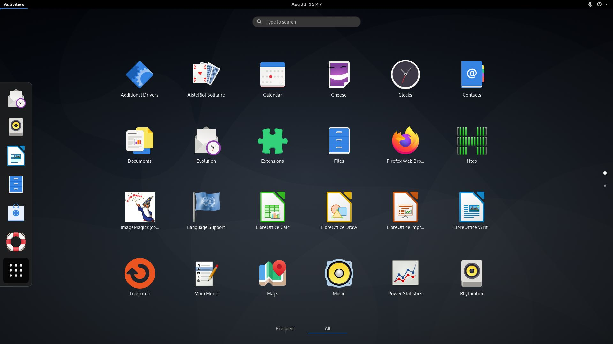
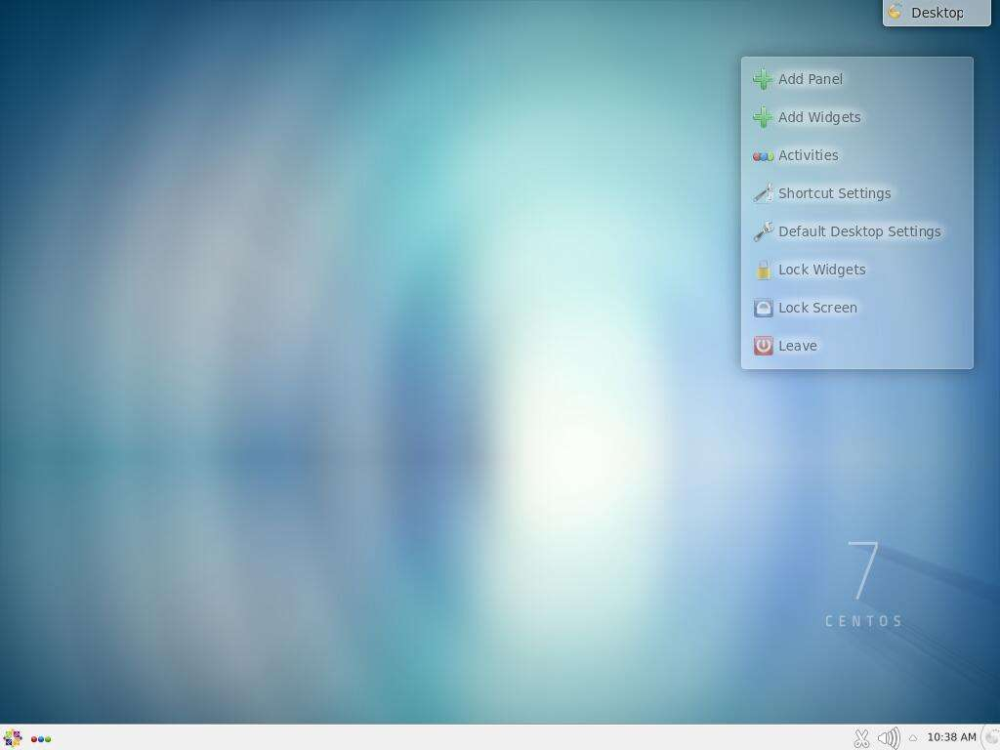
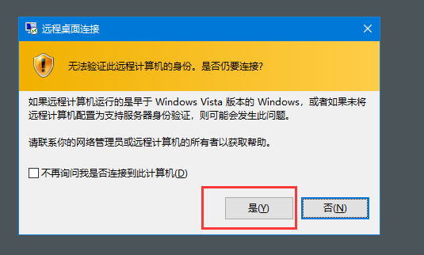
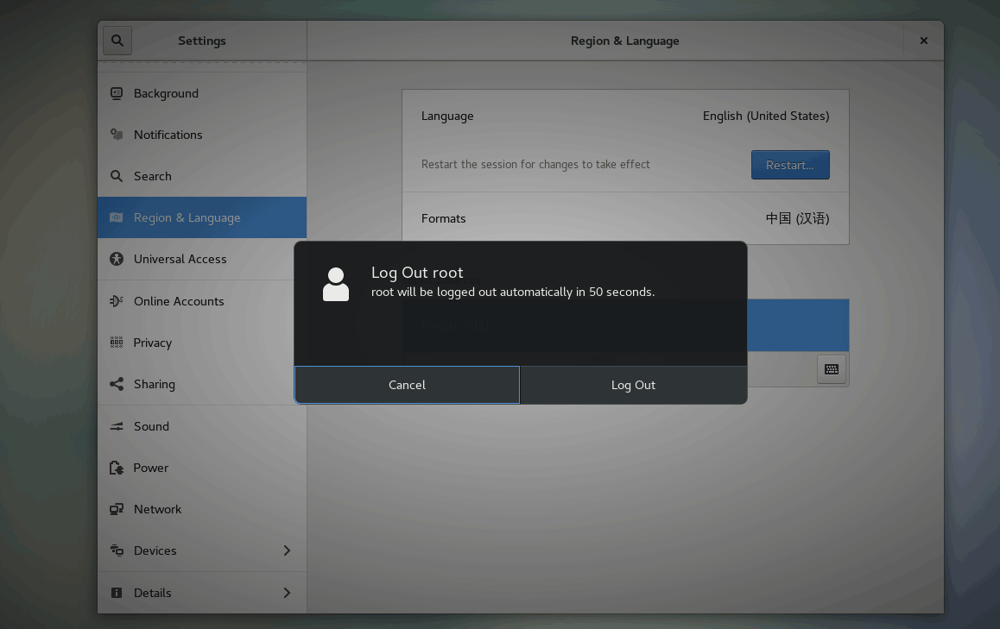
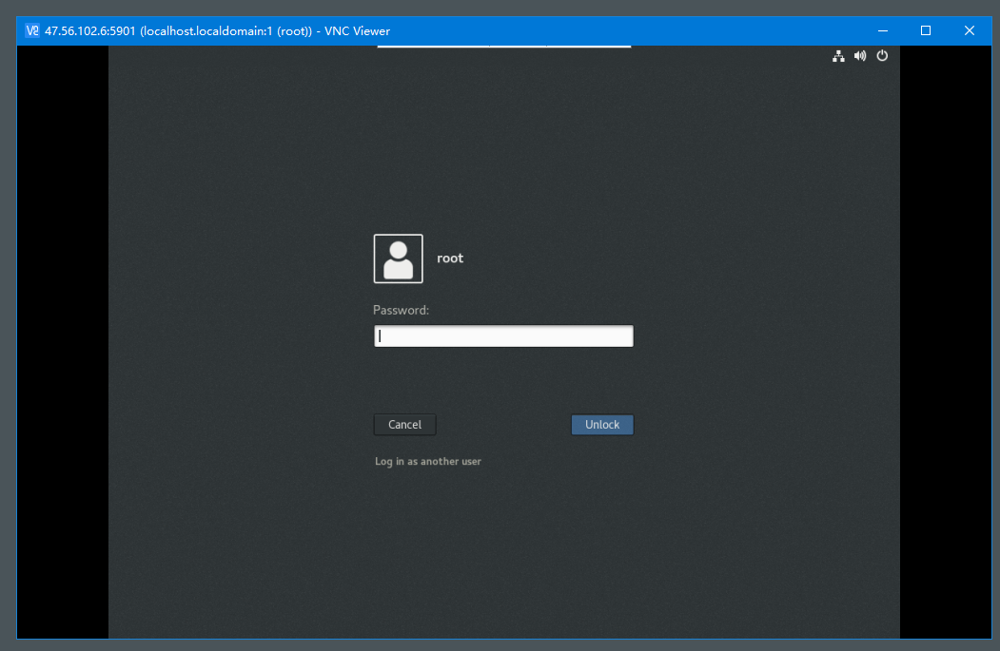

# Linux 桌面

Websoft9 在云端拥有丰富的 Linux 桌面经验，我们提供的 Linux 桌面的服务器托管，主要帮助客户解决一些需要桌面才能部署和管理应用的场景。

## 桌面版本

Linux 桌面并不是 Linux 的内核，而是一个扩展的应用程序。这个与 Windows 或 macOS 完全不一样。  

下面是最常见的几个 Linux 桌面版本：  

### Gnome

   
### KDE


### Mate


### Xfce


## 连接

连接 Linux 桌面主要有两种方式：XRDP 和 VNC 模式，推荐使用 [XRDP](https://cloudzy.com/rdp-vs-vnc-remote-desktop-comparison/)

|         | 速度 | 实现原理     | 多用户           | 平台                           | 安全协议   |
| ------- | ---- | ------------ | ---------------- | ------------------------------ | ---------- |
| **RDP** | 快 | 计算资源共享 | 继承操作系统用户 | Linux, Windows, macOS, Android | SSL/TLS    |
| **VNC** | 慢 | 屏幕贡献     | 没有用户         | Linux, Windows, macOS          | SSH tunnel |

### XRDP 连接

本地电脑如果是 Windows 系统，那么可以使用系统自带的远程桌面客户端去连接 Linux 桌面：  

1. 打开 开始菜单，输入”mstsc“ ，系统会搜索远程桌面连接工具  

2. 输入 **服务器公网IP** ，点击【连接】  
   
   
   > 确保云控制台中服务器安全组 3389 端口是开启状态
  
3. 如果出现下面的提示，点击【是】继续  
   
  
4. XRDP 对话框中，输入服务器 root 账号和密码
  
 
   > 建议采用普通用户登录 Linux 桌面，而不是 root 用户。请参照下面命令创建普通用户：
    ```
    sudo su 
    adduser xxxuser # 根据提示完成密码设置
    ```

5. 成功登录后，就可以看到 Linux 桌面

6. 以 Gnome 为例，打开：【Setting】>【Region&Lanuage】>【Language】设置中文（重启后生效）
  

### VNC 连接

VNC 是一种传统的连接 Linux 服务器桌面的方式：  

1. 使用 SSH 登录 Linux 桌面所在的服务器，设置你的 VNC 服务端访问密码
    ```
    sudo su
    rm -rf /root/.vnc/passwd
    vncpasswd
    ```
2. 本地电脑安装 [VNC viewer](https://www.realvnc.com/download/viewer/) 客户端

3. 登录云服务器控制台，为你的云服务器安全组中开启 **5901** 端口

4. 本地电脑打开 VNC 客户端，创建一个VNC连接（服务器公网IP地址：5901）
   

5. 点击【Continue】进入下一步
   

6. 输入VNC密码后登录即可进入图形化界面
   
   
   
   

7. 如果服务器处于下图所示的锁定状态，请输入你的**服务器的密码**进行解锁
   


8. VCN 使用过程中可参考如下命令进行维护  
   ```
   # 查看已经运行的桌面编号
   vncserver -list

   # 终止2号桌面进程
   kill -9 :1

   # 管理桌面服务
   systemctl start vncserver@:1.service
   systemctl stop vncserver@:1.service
   systemctl status vncserver@:1.service
   systemctl restart vncserver@:1.service
   ```


## 管理维护

### 设置桌面语言

设置 Linux 桌面为中文一般分三个步骤，安装语言包、安装字体(防乱码)和设置区域和语言，下面以 CentOS KDE 桌面为例演示：

1. 查询系统支持语言包并安装语言包
   ```
   yum search kde | grep -i chinese
   yum install kde-l10n-Chinese.noarch
   ```

2. 安装字体
   ```
   yum groupinstall "fonts"
   ```

3. 远程登录 KDE 桌面，设置语言: [system settings] - [Commone Appearance and Behavior] - [Local] - [Languages]

   

### 安装配置桌面{#desktop}

下面是自行安装和配置 Linux 的方案，供用户参考。

```
#  CentOS
yum groupinstall -y "GNOME Desktop" 
systemctl set-default graphical.target
systemctl set-default graphical.target

# OracleLinux
yum groupinstall -y 'Server with GUI'  # 如果这一步骤有错误,先执行 yum update 更新系统
yum install -y tigervnc-server tigervnc-server-module
systemctl set-default graphical.target
systemctl isolate graphical.target
systemctl get-default
```

### 安装配置 VNC Server{#vnc}

以 CentOS 为例（同样适用于 OracleLinux）介绍 VNC Server 安装详细流程：  

1. 安装 VNC Server

   ```bash
   yum install -y tigervnc-server tigervnc-server-module
   ```

2. 设置 VNC 密码

   ```
   # vnc 设置密码
   vncserver 
   ```

3. 增加 VNC Server 服务
   ```
   cat > /etc/systemd/system/vncserver@:1.service << EOF
   [Unit]
   Description=Remote desktop service (VNC)
   After=syslog.target network.target
   
   [Service]
   Type=forking
   
   ExecStartPre=/bin/sh -c '/usr/bin/vncserver -kill %i > /dev/null 2>&1 || :'
   ExecStart=/usr/sbin/runuser -l root -c "/usr/bin/vncserver %i"
   PIDFile=/root/.vnc/%H%i.pid
   ExecStop=/bin/sh -c '/usr/bin/vncserver -kill %i > /dev/null 2>&1 || :'
   
   [Install]
   WantedBy=multi-user.target
   EOF
   ```

4. 启动服务
   ```
   systemctl enable vncserver@:1.service
   systemctl start vncserver@:1.service
   ```

## 配置选项

* XRDP 连接端口： 3389
* VNC 连接端口：5901
* 服务
    ```
    # For RDP
    sudo systemctl start | stop | restart | status xrdp

    # For Gnome
    sudo systemctl start | stop | restart | status gdm

    # For VNC
    sudo systemctl start | stop | restart | status vncserver
    ```

## 故障

#### 远程桌面时，报错：“由于安全设置错误，客户端无法连接到远程计算机...”  

原因：本地远程桌面客户端与服务端协议不匹配    
方案：[修改本地客户端协议](https://blog.csdn.net/sherlockmj/article/details/123650902)  

#### useradd 创建的用户无法远程连接？

现象：`useradd` 创建用户，然后 `passwd username` 设置密码。这样的账户无法连接服务器  
原因： useradd 主要是用于创建应用账号，不是 Linux 系统账号  
方案： 使用 `adduser` 创建

#### 不知道 VNC 的连接密码？

使用 SSH 连接到服务器后，输入如下的命令设置密码即可
```
vncpasswd
systemctl restart vnc
```

#### 登录后，不小心锁屏了怎么办？

登录密码无法解锁，只能重启服务器后再登录。建议登录桌面后，关闭锁屏功能。

以 Gnome 为例，关闭步骤：【Privacy】>【Screen Lock】，将【Automatic Screen Lock】设置为 off

## 常见问题

#### 使用秘钥对是否可以连接桌面？

不可以，请先使用 **SSH** 登录服务器后，运行 `passwd` 命令为用户设置登录密码

#### RDP 为什么比 VNC 更快？

VNC 原理：服务器端渲染图像后，再把图像传输到客户端直接显示  
RDP 原理：服务器端传送**渲染图像的指令**，再传输到客户端经过**显卡计算**后显示  

标准的服务器没有显卡（GPU），故服务器渲染图像只能使用CPU，效率非常低。同时，传输图像比传输指令耗费的带宽更大。

#### 桌面锁定状态下是否支持秘钥解锁？

不支持

#### Gnome 的开机 Logo 是否可以修改？

可以，具体参考[此处](https://www.dazhuanlan.com/2020/03/01/5e5ab2a1bd7d8/)

#### 预装的是哪个 VNC Server？

主要是 [TigerVNC](https://github.com/TigerVNC/tigervnc)

#### 是否能安装web浏览器？

可以，以安装 Google Chrome 为例：

```
# For CentOS7
wget https://dl.google.com/linux/direct/google-chrome-stable_current_x86_64.rpm
sudo yum localinstall google-chrome-stable_current_x86_64.rpm
/usr/bin/google-chrome --no-sandbox

# For Ubuntu
wget https://dl.google.com/linux/direct/google-chrome-stable_current_amd64.deb
sudo apt install ./google-chrome-stable_current_amd64.deb
vim /usr/bin/google-chrome/google-chrome
exec -a "$0" "$HERE/chrome" "$@"  修改为 exec -a "$0" "$HERE/chrome" "$@" --no-sandbox
rm -r ~/.config/google-chrome
```