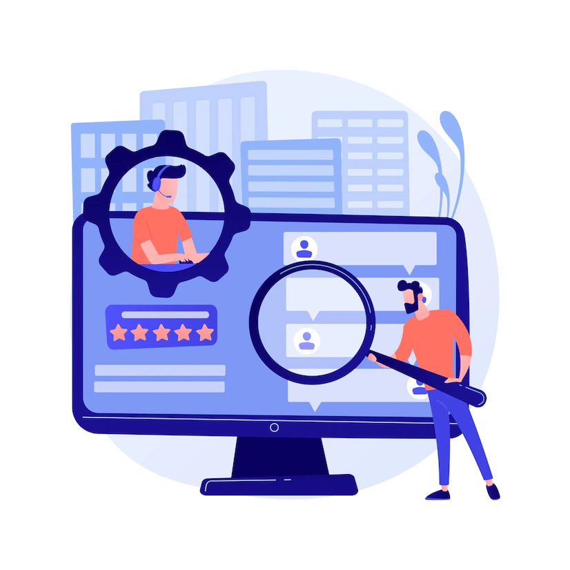

# 企业知识协作

## 挑战

传统的知识管理思维中，往往会过于关注企业知识管理的保密性。从而将知识变成了一个孤岛，知识无法有效的协作、共享和迭代。也就是说知识无法自主扩张和优化，慢慢的就变成鸡肋式的产物。

现代社会是信息爆炸，企业在运营中大多数知识实际上可以通过外部获取，根本不需要重复创造同类的知识。所以，知识管理逐渐向：客户参与、伙伴参与、内外部协作、快速流动、时效管理、AI 学习、结构化、在线化等方向演进。

企业 CEO 都非常重视知识沉淀和分享，但在实际运营过程中却发现存在如下常见的困扰：

* 一线员工知识提炼能力不足
* 知识在跨部门协作的时出现滞后、不准确的情况
* 人人似乎都在创作和总结，但企业却没有集中迭代知识的平台
* 内部知识库与外部知识库有大量重复部分
* 生成式人工智能已经流行，但却没有在企业中得到广泛使用

## 定义

Websoft9 倡导的企业知识协作它可以帮助企业方便的充分利用外部知识，同时具备集体创作和知识迭代的技术手段，结合 AI 技术，实现智能化的知识管理与协作。  

## 如何解决

知识协作是一个关键企业战略，不能陷入“一个软件搞定”的惯性思维，更不能依赖于软件公司的最佳实践，它需要企业高层主导推动：

### 确认知识战略

企业需要首先了解自己的知识战略：

- 结构化与非结构化的知识比重
- 知识的公开与保密
- 知识的社会化协作
- 知识变现
- 知识的搜索与阅读用户体验
- 人工创作知识和机器创造知识的比重
- 知识的存储方式

### 工具选型

针对战略再选择合适的工具，典型的工具包括：  

- 生成式人工智能：[ChatGPT Next Web](../chatgptnextweb)
- 非结构化的 ECM：[ONLYOFFICE](../onlyoffice)、[nextCloud](../nextCloud)、[Owncloud](../owncloud)、[Kod 可道云](../kodcloud)
- 在线的产品文档：Docusaurus
- 研发知识协作：[GitLab](../gitlab)、[Gitea](../gitea)、[TeamCity](../teamcity)
- 企业搜索引擎：[Elasticsearch](../elasticsearch)、[Typesense](../typesense)、[OpenSearch](../opensearch)