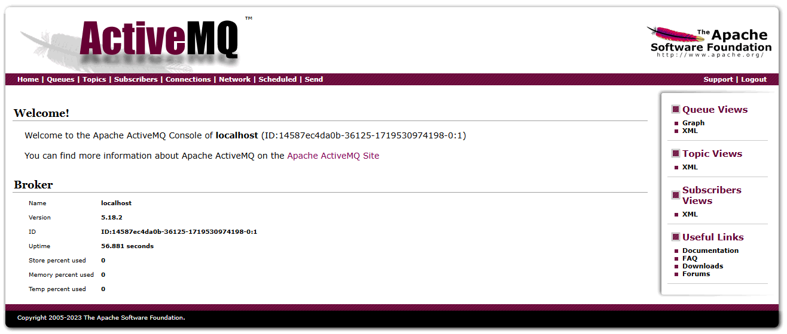

import Meta from './_include/activemq.md';

<Meta name="meta" />

## Getting started{#guide}

## Login to ActiveMQ Console

1. After completing the installation of ActiveMQ on the Websoft9 console, get the applicaiton's overview, credentials and access information from **My Apps**   

2. Use a local computer browser to access ActiveMQ, where you can see the Welcome page
   

3. Click on the link **Manage ActiveMQ broker** to access the management page
   

## Use Guide

Refer to the official documentation [Using Apache ActiveMQ](https://activemq.apache.org/using-activemq) to quickly understand its usage.  

## Configuration options{#configs}

- [Config ActiveMQ](http://activemq.apache.org/configuration.html)
- [Web Samples](https://activemq.apache.org/components/classic/documentation/web-samples)

## Administer{#administrator}

- To change the ActiveMQ Console password: Navigate to **Websoft9 Console > My Apps > ActiveMQ > Compose > Go to Edit Repository** to edit the *.env* file.

## Troubleshooting{#troubleshooting}
