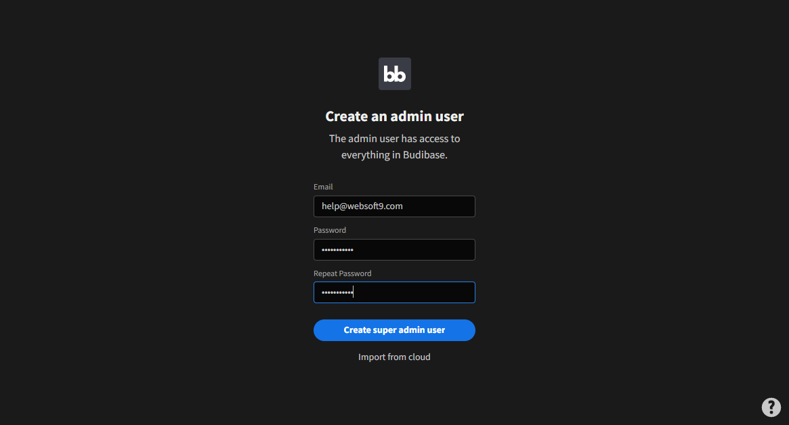
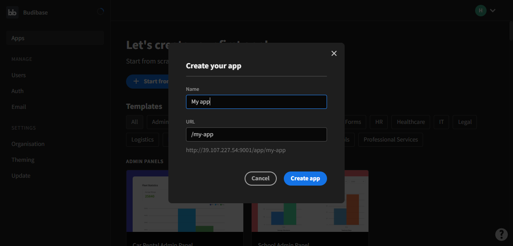

import Meta from './_include/budibase.md';

<Meta name="meta" />

## Getting started{#guide}

### Initial setup{#wizard}

1. When completed installation of Budibase at Websoft9 console, get the applicaiton's overview and access information from **My Apps**   

2. First time to accesss, need to register administrator user
   
   

3. Choose to create based on an existing template or a completely new approach to start creating the application

   

### Core components

- Data: Manage data sources, support Budibase to build internal tables for data modeling, also support connecting to external data sources.
- Design: page design, Budibase provides rich controls to build pages, data controls are used for data binding and rendering.
- Automate: Used to automate the execution of the design process, trigger conditions support data changes, Webhook, App Action and Cron.

## Configuration options{#configs}

- [API Reference](https://docs.budibase.com/docs/public-api)
- Multilingual (√)

## Administer{#administrator}

## Troubleshooting{#troubleshooting}