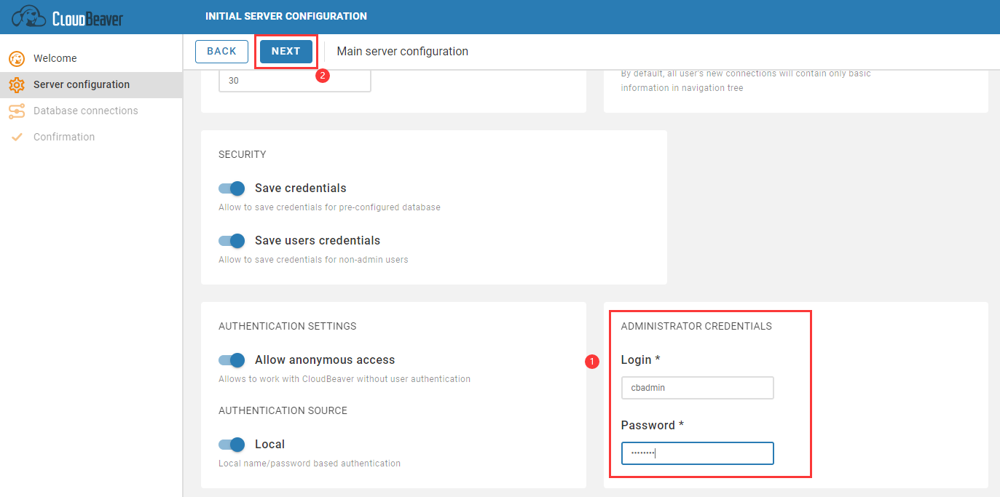
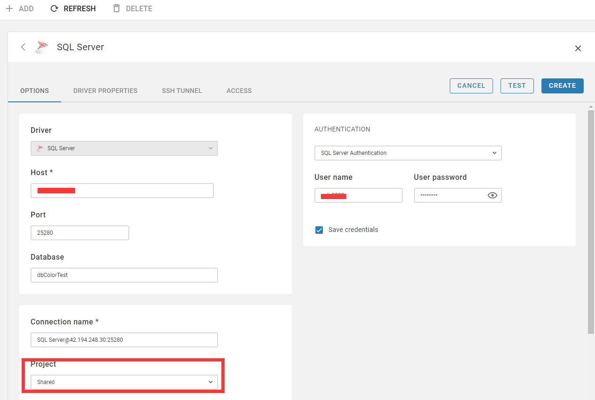
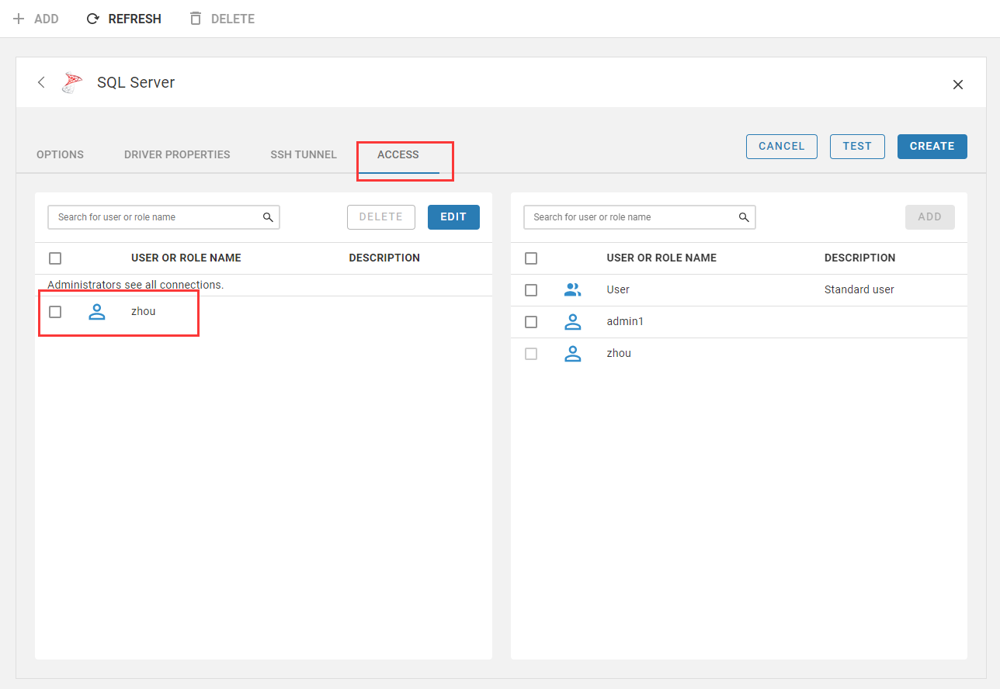

import Meta from './_include/cloudbeaver.md';

<Meta name="meta" />

## Getting started{#guide}

### Prepare the database

CloudBeaver is a tool for managing databases. If you don't have a database, you can install it through the Websoft9. 

- The Websoft9 provides one-click installation templates for databases, including MySQL/PostgreSQL/SQLite/SQLServer/Oracle.
- Databases installed through Websoft9 can connect with CloudBeaver through the container ID as Host without opening the external network port.

### Verify CloudBeaver

When completed installation of CloudBeaver at **Websoft9 Console**, get the applicaiton's **Overview** and **Access** information from **My Apps**  

1. Visit the URL using your local computer's browser, complete the install wizard step by step.
   

2.  Select **Administrator > Connection Management**, delete **SQLite-Chinook (Sample)** to avoid SQL injection attack.
   

3. Go back to the homepage, the default SQLite demo connection no longer exists.

### Managing Databases

1. CloudBeaver console, select **Settings > Administration > Connection Management**, add the required database connection.
   

2. Set the connection information: host address, port, account password, and then click [Save].

3. Test the connection availability.

### Shared Data Connection

Shared Data Connection is a shared connection access that the administrator can grant to a team of users by changing the connection configuration.

1. Configure the connection as shared

   

2. Authorize the user

   

## Configuration options{#configs}

- Multilingual(✅): Chinese not supported
- Database connection driver: JDBC
- Configuration file: /path/GlobalConfiguration/.dbeaver/data-sources.json
- [Supported databases](https://dbeaver.com/databases/)
- Export data(✅): only table export is supported

## Administer{#administrator}

- [Driver managements](https://cloudbeaver.io/docs/Driver-managements/)

## Troubleshooting{#troubleshooting}

#### Failed to connect to Oracle database?

If the account is correct, you still cannot connect to the Oracle database. In this case, check if the CloudBeaver database driver matches the Oracle version. 