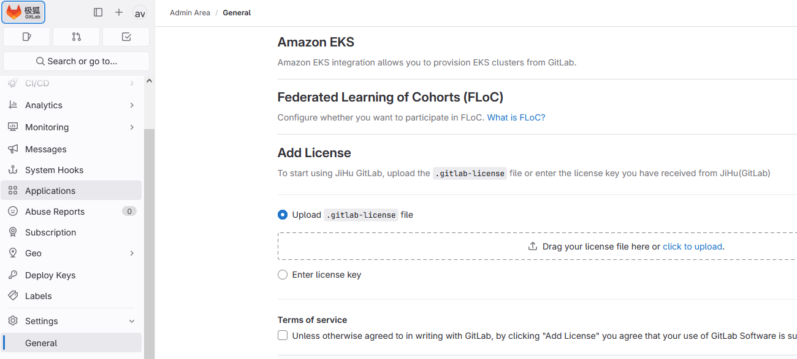

import Meta from './_include/gitlab.md';

<Meta name="meta" />

## Getting started{#guide}

### Login verification{#verification}

1. After installing GitLab on the **Websoft9 console**, view the application details through **My Applications** and get the login information in the **Access** tab.  

2. After accessing from your local computer's browser, go to the login page (it will take 2-3 minutes to load for the first time, do not reboot at this time, otherwise the login password will be invalid)
   

3. Enter your account and password then access the GitLab console.
   

4. Start setting the language, creating a new repository and creating a new user, etc.

### Set the GitLab repository address{#setrepourl}

The repository address is different from the GitLab console address.  

Refer to: [Configure External URL](https://docs.gitlab.com/omnibus/settings/configuration.html#configuring-the-external-url-for-gitlab) to configure the value of the **external_url** entry.

## Enterprise Edition

#### Why work with Websoft9?{#why}

Websoft9 is a partner of Gitlab (including [JiHu Gitlab](#jihu)), and by purchasing GitLab through Websoft9, you can get:

- More favorable discounts
- More technical support coverage
- More comprehensive DevOps technology integration and consulting
- 2-month trial license of Jihu Gitlab  Enterprise Edition (Jihu Gitlab  officially licenses Websoft9 to provide Enterprise Edition support on the public cloud)

#### About JiHu Gitlab{#jihu}

JiHu Gitlab is an independently owned and operated GitLab company in China that provides localized GitLab products and services to users:

- JiHu GitLab is available in Free, Premium, and Ultimate editions, with a free trial available for the Free edition.
- JiHu GitLab upstream repository is GitLab and is synchronized at a high frequency.
- JiHu GitLab SaaS service is based on local Chinese infrastructure and is completely independent of GitLab global SaaS.
- JiHu GitLab functionality and operations are the same as GitLab, with some localized features that are tailored to help the local user experience.

### Import an Enterprise license{#lic}

1. Prepare the required license

   - **JiHu GitLab license**: This can be downloaded from [this URL](https://websoft9.github.io/docker-library/apps/jihu/src/gitlab.license).
   - **GitLab license**: You have to apply for this yourself. You can go to the [official GitLab website](https://about.gitlab.com/pricing/) to apply.

2. Login to GitLab and import the license: Select **Admin Area > Setting > General > Add Licenses**, upload a license file
   

### Convert CE to EE

Conversion [relationship](https://about.gitlab.com/install/ce-or-ee) between GitLab CE (Community Edition) and GitLab EE (Enterprise Edition):

- If GitLab EE is installed, EE functionality is disabled at the end of the trial period, but CE functionality is still available
- If GitLab CE is installed, you need to change the image label to EE and rebuild the container to seamlessly [upgrade to EE](https://docs.gitlab.com/omnibus/update/README.html#updating-community-edition-to-) enterprise-editio)


## Configuration options{#configs}

- Cli: `gitlab-ctl`
- [API](https://docs.gitlab.com/ee/api/) : `curl "https://gitlab.example.com/api/v4/projects"`
- Multilingual (✅ ): Select **User Settings > Preferences** to set the language
- SMTP (✅ ): The relevant values in the configuration file are as follows
   ```
   gitlab_rails['smtp_enable'] = true
   gitlab_rails['smtp_address'] = "smtp.exmail.qq.com"
   gitlab_rails['smtp_port'] = 465
   gitlab_rails['smtp_user_name'] = "xxxx@xx.com"
   gitlab_rails['smtp_password'] = "password"
   gitlab_rails['smtp_authentication'] = "login"
   gitlab_rails['smtp_enable_starttls_auto'] = true
   gitlab_rails['smtp_tls'] = true
   gitlab_rails['gitlab_email_from'] = 'xxxx@xx.com'
   ```
- Configuration file (mounted) : */etc/gitlab/gitlab.rb*
- [GitLab architecture](https://docs.gitlab.com/ee/development/architecture.html) : GitLab contains [dozens of components](https://docs.gitlab.com/ee/development/architecture.html#component-list), available at */opt/gitlab/version-manifest.txt*.

- GitLab Runner: The GitLab Runner is an additional component that you need deployed by yourself.


## Administer{#administrator}

- **Reset the administrator password**: Access the container and run the `gitlab-rails console` to [reset password](https://docs.gitlab.com/13.11/ee/security/reset_user_password.html)
- **Modify repository directory**: [Repository storage paths](https://docs.gitlab.com/ee/administration/repository_storage_paths.html)

## Troubleshooting{#troubleshooting}

#### Company fixed IP suddenly cannot access Gitlab?

Description: Gitlab cannot be accessed through the company network (fixed IP), while it can be accessed through your own cell phone wifi.   
Reason: GitLab has a rack-attack security mechanism. Under certain conditions (e.g. a large number of concurrent company accesses to GitLab) rack-attack security incorrectly blocked your IP, resulting in not access to GitLab.   
Solution: Modify the Gitlab configuration file for the rack-attack entry

#### Getting a 502 error accessing GitLab? {#502}

Description: GitLab throws a 502 error when accessing GitLab for the first time or when there are many visitors?   
Reason: GitLab requires a minimum of 4G of RAM, so if the server configuration is insufficient, 100% of 502 errors will occur. In addition, for single-core CPU servers, it takes at least one minute for the Unicorn and Sidekiq services to start, and if they don't finish, they will also report a 502 error!   
Solution: Upgrade the server configuration

#### Cannot connect to PostgreSQL?

Description: when using the database client, you cannot connect to PostgreSQL in the GitLab container?  
Reason: Under the default installation, GitLab uses Peer Authentication to communicate with PostgreSQL. This means that the client can only access the database as the Linux system account on the host where PostgreSQL is located, and cannot access it remotely.

