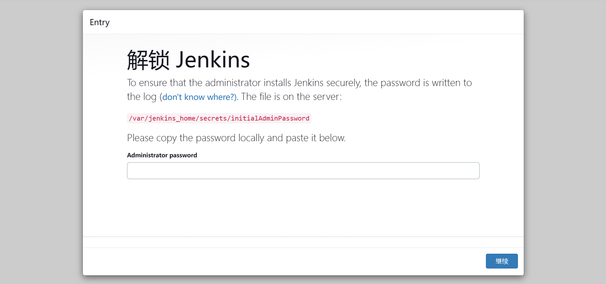
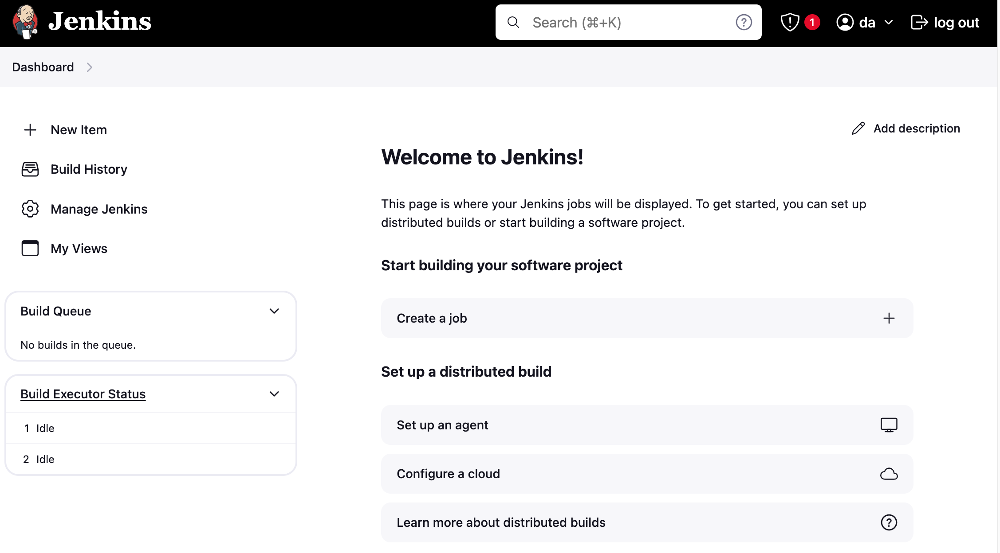

import Meta from './_include/jenkins.md';

<Meta name="meta" />

## Getting started{#guide}

### Initial setup{#wizard}

1. When completed installation of Jenkins at Websoft9 console, get the applicaiton's overview and access information from **My Apps**  

2. Access the initialization page, Jenkins prompts to unlock
   

3. Access jenkins container, and run below command to get unlock password

   ```
   cat /var/jenkins_home/secrets/initialAdminPassword
   ```

4. After successful login, complete the following steps: installing plugins, creating administrators, etc

5. Go to Jenkins Console and start using it
   

### Github + Jenkins automatic construction

The following is a task to help users quickly get started by using Jenkins to automatically build and deploy projects on Github:

1. Set **Personal access tokens** in GitHub for Jenkins connection

2. Ensure that the Github plugin is installed and enabled in Jenkins

3. Create a job at Jenkins, set the source code from Github, and set the triggering strategy

## Configuration options{#configs}

- Install and manage plugins: **Manage Jenkin > Plugins**

- [Multilingual](https://www.jenkins.io/doc/book/using/using-local-language/)(✅)

- SMTP: Install Jenkins plugin [Email Extension](https://plugins.jenkins.io/email-ext/), then **Manage Jenkins > Configure System**

- [Jenkins CLI](https://www.jenkins.io/zh/doc/book/managing/cli/)
   ```
   java -jar jenkins-cli.jar [-s JENKINS_URL] [global options...] command [command options...] [arguments...]
   ```

- [REST API](https://www.jenkins.io/doc/book/using/remote-access-api/)
   ```
   curl JENKINS_URL/job/JOB_NAME/buildWithParameters --user USER:TOKEN --data id=123 --data verbosity=high
   ```

- Online upgrade(✅): When there is an update, the backend will prompt and you can update and upgrade online through the backend

## Administer{#administrator}

- Backup and Recovery: [Backup plugin](https://plugins.jenkins.io/backup/) provides backup and recovery capabilities for Jenkins.

## Troubleshooting{#troubleshooting}
