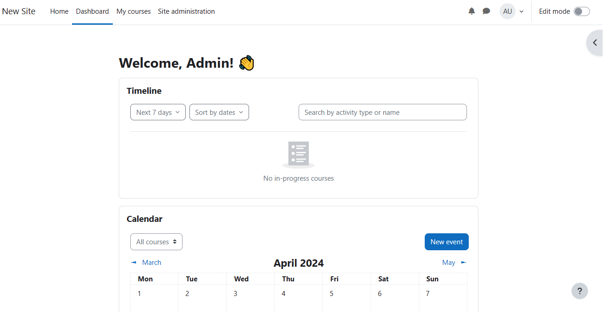

import Meta from './_include/moodle.md';

<Meta name="meta" />

## Getting started{#guide}

### Login Verification{#verification}

1. Completed installation Moodle at Websoft9 console, get the applicaiton's overview and access credentials from "My Apps"  

2. Starting to verify it
   
   
### Register as an official member{#register}  

After Moodle initialization, it is recommended to register as a member with Moodle official to facilitate online installation of plugins  
 
1. Login to the Moodle backend as an administrator and open: "Site administration">"egistration" in sequence  

2. After registration is completed, login and your Moodle will establish a connection with the official account  

### Install plugin{#plugin}
 
1. Login to the Moodle backend as an administrator  

2. Open "Site administration">"Plugins" in order to view or install plugins  

3. Supports two installation methods for plugins: 
    
   - Online installation: Install plugins from the Moodle plugin directory 
   - Offline installation: Upload zip file for installation

### Install Theme{#theme}  

1. The Moodle theme is actually a plugin, which can be installed first through the "install Plugin" method  

2. Open "Site administration">"Appearance">"Theme selector" to change the theme

## Configuration options{#configs}

- [Plugin](https://moodle.org/plugins/)(✅) 
- [Topic](https://moodle.org/plugins/)(✅):Theme is also a type of plugin 
- Configuration file (mounted): */bitnami/modle/config.php* 
- PHP configuration modification: modify through the .env file of application   
- Media files(✅) 
- Multilingual(✅): "Site administration">"Language">"Language Packs"  
- SMTP(✅): "Site administration">"Server">"Email">"Sending Email Settings"  
- Mobile end(✅): "Site administration">"Mobile Applications">"Mobile Device Settings">"Enable Network Services for Mobile Devices" 
- [Plugins](https://docs.moodle.org/37/en/Installing_plugins) 
- [Administration via command line]( https://docs.moodle.org/311/en/Administration_via_command_line ) 
   ``` 
   $sudo - u Apache/usr/bin/php admin/cli/somescript.php -- params 
   $sudo - u Apache/usr/bin/php admin/cli/install.php -- help 
   ``` 
- [Core APIs](https://docs.moodle.org/dev/Core_APIs) 
- Online backup: "Website Management">"Courses">"Automated backup setup"

## Administer{#administrator}

- **Retrieve Password**: Modify the *mdl_user* table in the Moodle database, replace the value of the `password` field with `21232f297a57a5a743894a0e4a801fc3`, and reset the password to `admin`

## Troubleshooting{#troubleshooting}