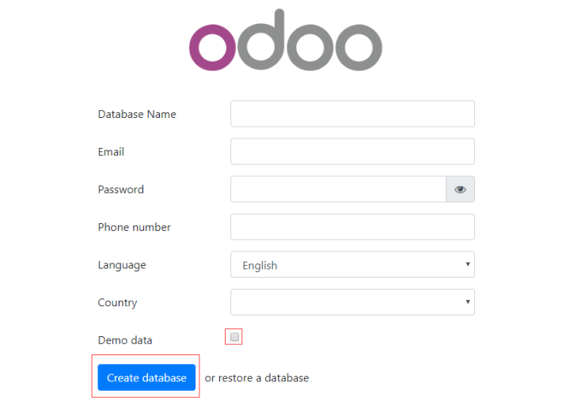

import Meta from './_include/odoo.md';

<Meta name="meta" />

## Getting started{#guide}

### Initial setup{#wizard}

1. When completed installation of Odoo at **Websoft9 Console**, get the applicaiton's **Overview** and **Access** information from **My Apps**  

2. Access the URL using a local browser to start the initialization : create the database.
   

3. Fill in all the parameters (Email and Password are login accounts), select **create database** and wait for the initialization completion.

4. Login to the backend, by default, you will enter the Apps page.  
   

5. select the **Settings** icon on the upper left corner to open the **Settings** item, you can set the language, enterprise information, etc.

### Developer mode {#dev-mode}

How to enable developer mode: select **Settings > Developer Tools > Active the developer mode**.

### Export PDF

Install Invoice, Purchase and other modules to test the **print to PDF** function.

## Enterprise Edition

To use the Enterprise Edition, contact the [Websoft9 Customer Success Team](./helpdesk#contact) for image and trial license.

- The trial license is required after the first application is installed in Enterprise Edition.
- After 1-month expired, the database will be emptied.

Websoft9 provides procurement, delivery and full hosting of Odoo Enterprise Edition:

- Efficient business processes
- Fully managed services for both public and private clouds
- Low-code development of Odoo for in-house management

## Configuration options{#configs}

- [Odoo Apps Marketplace](https://www.odoo.com/apps/modules) (✅)

- Customize Logo (✅ ): Select **Settings > Users & companies > companies > My Company > Your logo**

- Multi-tenant (multi-business organization) (✅): **Manage Databases** in the Odoo login interface to enter the database management, where adding a database, that is, adding a business, multiple databases can share the Odoo runtime

- multilingual (✅): Select  **Preferences** in the settings menu at the top right corner to set the language.

- Odoo Configuration file (mounted): */etc/odoo/odoo_config/odoo.conf*  

- CLI: `odoo -h`

- [API](https://www.odoo.com/documentation/17.0/developer/misc/api/odoo.html)

- Community Edition Online Upgrade to Enterprise Edition (✅ )

- SMTP (✅ ): Select **Settings > General Settings > Discuss > Use Custom Email Servers**, if can not find **Discuss** option, you need first select Mail Plugin in Integrations.

## Administer{#administrator}

- **Database Management**: Odoo comes with a database manager, accessed from the **Manage Database** link on the Odoo login page. It supports operations such as create, copy, backup, restore and delete.

## Troubleshooting{#troubleshooting}

#### Delete Demo data?

There is no easy tool to delete demo data.

#### 413 Request Entity Too Large?

You need to configure `client_max_body_size 0` in Websoft9 gateway to release the file limit.
