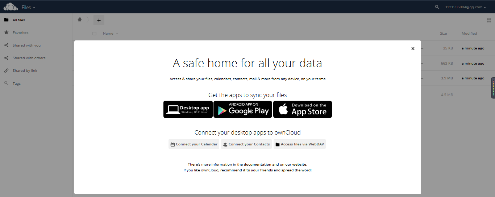

import Meta from './_include/owncloud.md';

<Meta name="meta" />

## Getting started{#guide}

### Initial setup{#wizard}

1. When completed installation of OwnCloud at **Websoft9 Console**, get the applicaiton's **Overview** and **Access** information from **My Apps**  

2. Visit the URL of OwnCloud, login to the backend and start using it
   

### Document preview and editing ONLYOFFICE {#onlyoffice}

1. Optional: Websoft9 console **App Store**, install ONLYOFFICE

2. Install ONLYOFFICE in the OwnCloud Backend Market

3. After installation, **settings > Admin > additional** to set ONLYOFFICE connection
   

### Connecting to external storage {#oss}

- ownCloud backend: You can setup external storage by **settings > admin > Storage**  
- Requires S3 support, need to be installed in Market **External Storage: S3** 

### Rebuild Indexes

After moving or copying your ownCloud data directory to another location, you need to run `occ files:scan --all` to rebuild the index

## Configuration options{#configs}

- [Marketplace](https://marketplace.owncloud.com/) 

- SMTP(✅): **settings > admin > Email server**

- Support third-party storage(✅)

- Multilingual(✅): OwnCloud background **Personal > General** to set the language

- Mobile: OwnCloud Desktop Client, OwnCloud Android App, OwnCloud iOS App

- Document Editing and Preview: Integration with [ONLYOFFICE Docs](./onlyofficedocs) and other third-party middleware.

- Configuration file (mounted): */mnt/data/config/config.php*

- CLI: [ownCloudcmd](https://doc.ownCloud.com/desktop/next/advanced_usage/command_line_client.html)

- [API](https://doc.ownCloud.com/server/next/developer_manual/core/apis/provisioning-api.html)

## Administer{#administrator}

- **Modify URL**: Modify OWNCLOUD_DOMAIN and OWNCLOUD_TRUSTED_DOMAINS [environment variables](https://doc.owncloud.com/server/10.13/admin_manual/configuration/server/config_sample_php_parameters.html#define-list-of-trusted-domains-that-users-can-log-into), changing config.php will not work

- **Online Backup**: Online Backup by **[OwnBackup](https://en.websoft9.com/xdocs/owncloud-image-guide/#using-apps)** application

## Troubleshooting{#troubleshooting}

#### untrusted domain?

Description: Initialization prompt You are accessing the server from an untrusted domain  
Solution: Apply OWNCLOUD_DOMAIN and OWNCLOUD_TRUSTED_DOMAINS as real URLs in the orchestration file .env

