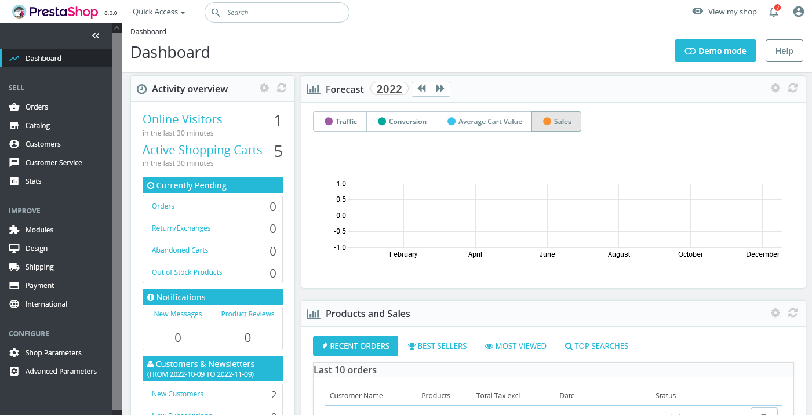

import Meta from './_include/prestashop.md';

<Meta name="meta" />

## Getting started{#guide}

### Initial setup{#wizard}

1. When completed installation of Prestashop at **Websoft9 Console**, get the applicaiton's **Overview** and **Access** information from **My Apps**  

2. Login to the Prestashop backend
   

3. Click on the **Shop Parameters** item on the left menu and scroll down to the **Set shop URL** on the page

4. If you access Prestashop by domain name, remove the port in default URL, and **Save** it to take effect

### Installing extensions from Marketplace

Prestashop 8.0 does not support backend online connection to Marketplace, so to install extensions from Marketplace, you need to: **Purchase > Download Extensions > Import Backend**

## Configuration options{#configs}

- Maintenance mode(✅): **Shop Parameters > General > Maintenance**
- Extended Marketplace(✅)
- SMTP(✅): **Advanced Parameters > Email**
- Demo Data Import(✅): **Advanced Parameters > Import**
- Online Installation of Extensions(✅): Supports online installation, uninstallation and upgrading of extensions
- Multi-language(✅)
- Import languages online(✅): **International > Translations > Add / Update a language**, no **Chinese** import option available at this time
- Developer mode(✅)
- URL update: left menu **Shop Parameters** item, scroll down to **Set shop URL** setting item in the page.
- Background login address: viewed through Websoft9 console My Applications
- CLI
  ```
  # list all cli
  php bin/console list

  # get help of prestashop:config
  php bin/console prestashop:config -h
  ```

## Administer{#administrator}

- **Database Backup**: PrestaShop provides a backend database backup function: **Advanced Parameters > SQL Manager**

- **Online Upgrade**: In PrestaShop Module Manager, install and enable **1-Click Upgrade**.

## Troubleshooting{#troubleshooting}

#### Access to PrestaShop always appear port?

You need to login to the backend and then click [Fix URL](#url)

#### Failed to access frontend after configuring HTTPS? 

Set database table ps_configuration properties PS_SSL_ENABLED_EVERYWHERE and PS_SSL_ENABLED to 1

#### Prestashop redirection error?

Redirection errors are common in multiple languages. For example, opening the Chinese version of your Prestashop store will lead to a redirection

Solution:

1. Analyze the `.htaccess` file in the root directory of your website to see if there are any deadlocks.
2. Remove the self-installed language pack. Re-import again, Prestashop will automatically generate pseudo-static rules to overwrite the original `.htaccess` file.

