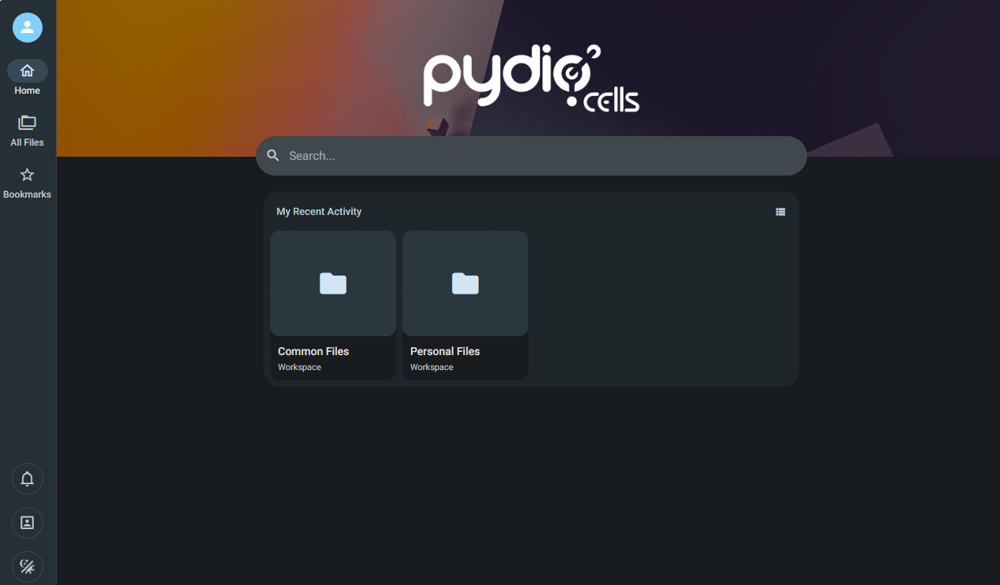
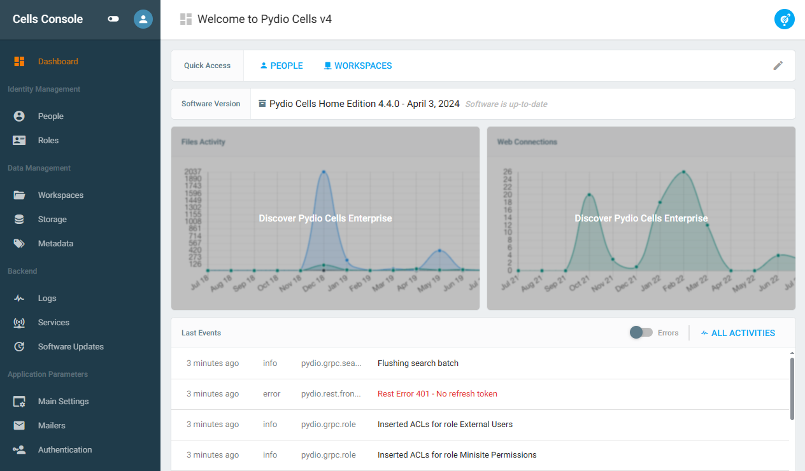

import Meta from './_include/pydio.md';

<Meta name="meta" />

## Getting started{#guide}

### Initial setup{#wizard}

1. When completed installation of Pydio at **Websoft9 Console**, get the applicaiton's **Overview** and **Access** information from **My Apps**  

2. After logining, the user interface is displayed by default
   

3. **Admin > Cells Console** in the upper right corner, switch to the administrator settings interface.
   

### External Storage

Access the storage management interface through **Pydio Console > Cells Console > Storage**, click **+datasource** to add the data source

### Document editing and previewing {#docs}

Pydio provides middleware support for [Collabora Online](./collabora) and [ONLYOFFICE](./onlyofficedocs)(Enterprise Edition only):

1. Optional: Websoft9 App Store installation of [Collabora Online](./collabora)
2. Enable the Collabora Online plugin in the Cells Console console
3. Set up connection to Collabora Online

## Configuration options{#configs}

- Plugin market(✅): **Application Parameters > All Plugins**, more plugins for Enterprise Edition
- Compatible External Storage: S3, Minio
- [Cells Client](https://pydio.com/en/docs/developer-guide/cells-client)
- [API Documentation](https://pydio.com/en/docs/developer-guide)
- [Mobile](https://pydio.com/en/download)
- Configuration file: It is suggested to personalize the configuration through the container environment variables

## Administer{#administrator}

## Troubleshooting{#troubleshooting}

#### No Application Parameters?

There is a switch for Application Parameters on the left menu oaf the Cells Console

