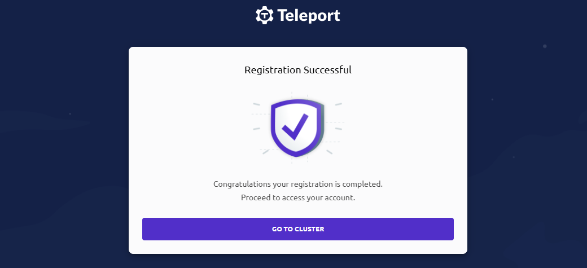

import Meta from './_include/teleport.md';

<Meta name="meta" />

## Getting started{#guide}

### Follow up steps for installation(necessary){#create-user}  

After installing Teleport on the Websoft9 console, the following steps need to be completed in order to login to the background:  

1. Ensure that the domain name is bound to Teleport and HTTPS access is set(**Required**)  

2. Modify the configuration file of Teleport by changing the example domain name in the *public-addr* configuration item to your own real domain name (keeping port 443), which will take effect after rebuilding the application.  
   ``` 
   public_addr: 
      - 'example.domain.com:443' 
   ``` 

3. Run the following command in the Teleport container to create a super user and also produce a registration link (URL) 
   ``` 
   tctl users add admin --roles=editor,auditor,access --logins=root,ubuntu,ec2-user 
   ``` 
   > -- logins=root,ubuntu,ec2 user are required, otherwise you will not be able to connect to the managed Linux later on 

4. Run the registration link in local browsing to complete password settings 

   > If the link is inaccessible or unsuccessful, it indicates that steps 1-2 have not been completed or there is an issue   
   
   

5. By using the username and password generated in the above steps, you can login to the Teleport console 
   
   

### Manage resources  

#### Connecting to remote Linux  

1. Login to the Teleport console, Resource > Enroll New Resource  

2. Select an operating system and generate a client installation link  
   
   

3. Login to the remote Linux server, copy the previous link to the command line interface, and start the installation  

4. After successful installation, return to the Teleport console. Teleport will automatically detect the client and prompt the user to follow the wizard to complete the next steps  

   

## Configuration options{#configs}

- Configuration file: *src/config/delete.yaml*
- Multilingual (x) 
- IP: Port access method (x): Self generated certificate is not secure 
- Two Factor authentication: We have disabled Two Factor authentication in the default configuration file of Teleport. If you need to enable it, please modify the configuration file and rebuild the application

## Administer{#administrator}

## Troubleshooting{#troubleshooting}

#### After filling in the password during the registration process, registration still fails?  

Ensure that the registration link is accessed through HTTPS. 

#### Failed to connect to the server through public network and port?  

Problem description: When adding resources, run the installation command on the connected server and display curl failed to verify 

Reason for the problem: The self signed certificate has been identified as insecure and connection is not allowed