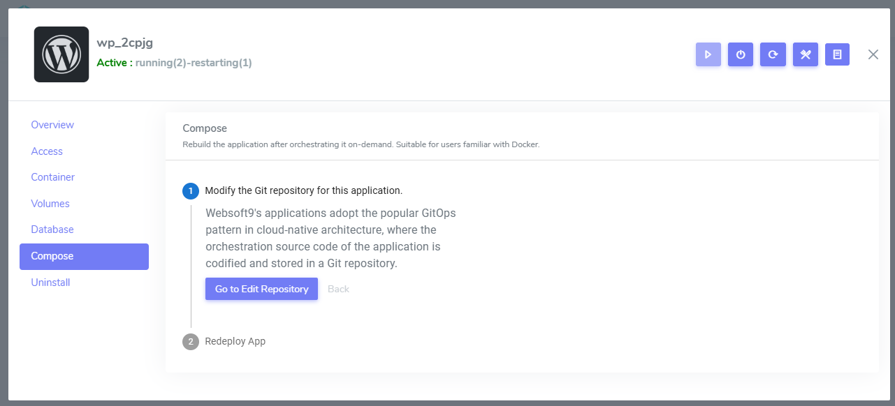

# Update your deployment

尽管基于 Websoft9 应用商店的部署模板能够快速启动应用，但这些模板并不总能预先满足所有用户的个性化需求。  

Websoft9 托管平台允许用户在应用启动后，使用**编排工具**对应用结构进行动态调整，并支持应用配置的深度个性化定制。    

## 原理

应用编排是重新配置应用的过程，其操作对象为存储在 Git 仓库中的原生 [docker compose](https://docs.docker.com/compose/) 项目。

实现个性化配置仅需以下两个步骤：

1. 修改[ Docker Compose 项目文件](./plan-git#modify) 中的编排对象

   - src 目录：存放的是应用的配置文件，可能会挂载到容器
   - .env：应用的环境变量文件
   - docker-compose.yml：应用的编排文件

2. [重建应用](./app-lifecycle#rebuild)

## 动态编排应用{#dynamic}

动态应用编排指的是在应用正常运行的状态下进行的实时调整过程。该过程包括以下步骤：

1. Websoft9 控制台，通过 "我的应用" 菜单进入目标应用的管理界面的 "编排" 标签页
   

2. 点击 "马上修改"，系统跳转到应用对应的 **Git 仓库** 页面
   

3. 调整目标配置文件（通常是修改 `.env` 文件）并保存更改

   > 请勿修改命名以 **W9_** 开头的环境变量，除非熟悉 Websoft9 的[模板编排规则](https://github.com/Websoft9/docker-library/blob/main/docs/code_owner.md)

4. 重新应用管理的 "编排" 标签页，点击 "重建应用" 按钮或右上角的重建图标

5. [重建应用](./app-lifecycle#rebuild)后生效

## 全新编排应用{#reset}

全新编排应用相对于[动态编排](#dynamic)来说，它需要删除应用的容器以及数据卷，确保应用启动后处于初始的出厂设置。  

1. 登录 Websoft9 控制台，点击左侧 "容器" 菜单，在容器管理中完成以下操作：
   
   - 通过 "Stack" 删除目标应用下的所有容器
   - 通过 "Volumes" 删除目标应用遗留的数据卷

2. 重建应用或参考[动态编排](#dynamic)进行个性化编排后再重建

## 自定义应用的配置项{#configs}

为了满足用户设置应用的配置文件和配置项，Websoft9 托管平台提供了灵活的自定义配置选项：

- **环境变量自定义**：用户可以通过编辑 `.env` 文件来设置环境变量，这种方式简单快捷，适用于快速配置应用的运行参数。

- **修改配置文件**：将自定义的配置文件提前挂载到容器中，用户只需要修改配置文件内容即可

请根据应用提供的模板和文档进行相关配置的个性化设置。

## 参考文档

- [docker compose 官方文档](https://docs.docker.com/compose/)
- [Websoft9 应用商店模板规范](https://github.com/Websoft9/docker-library)

## 问题与故障

#### 修改环境变量后不生效？

此情况是正常的。有些环境变量仅用于容器的首次创建，后续修改是不生效的。例如 MySQL 镜像的环境变量 `MYSQL_PASSWORD`。  

这种情况是由容器镜像的作者在设计时的考量，并不是故障。    

#### 编排文件改错了？

基于 Git 仓库的编排文件，可以很方便进行[还原](./plan-git#modify)操作

#### 重建应用时拉取镜像失败？

可以再次重试或提前在服务器上拉取相关镜像

