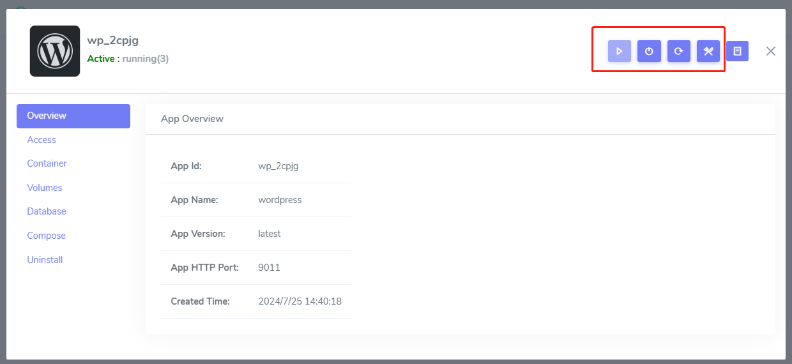
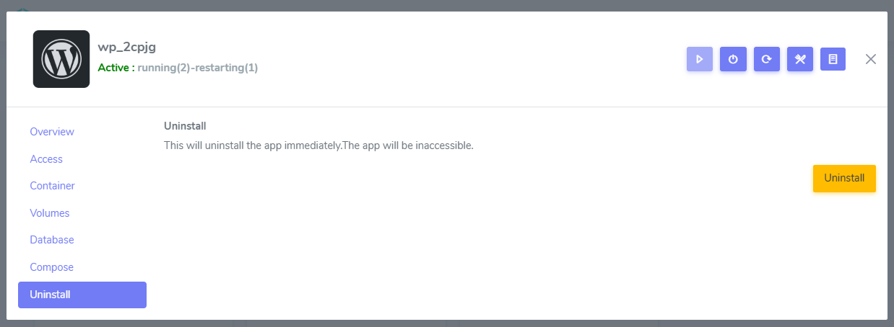

# Manage application lifecycle

在本节中，我们将专注探讨应用的关键操作阶段：启动、停止、重启、卸载等。

Websoft9 托管平台提供了包括图形用户界面以简化这些操作的执行。为了适应复杂的部署和运维需求，平台还支持自动化脚本和 API 调用，使得生命周期管理可以无缝地集成到用户的现有工作流程中。

## 停止应用{#stop}

停止目标应用中所有正在运行的容器

## 启动应用{#start}

启动目标应用中所有已经停止运行的容器

## 重启应用{#restart}

重新启动目标应用中所有状态的容器

## 卸载应用{#uninstall}

卸载操作主要是删除应用的 Git 仓库、网关配置和所有相关容器资源（容器和数据卷）。  

默认卸载仅会删除容器，保留其他的资源以方便后期重建。若需彻底卸载应用，需在进行卸载操作时，勾选 "是否清除数据"。

## 重建应用{#rebuild}

重建应用是一项 Websoft9 关键操作，旨在**保留数据的前提下**刷新应用的运行环境，确保应用以最新的状态和配置运行。   

重建的基本流程：

1. 停止应用的服务
2. 删除容器
2. 重新拉去镜像（可选）
3. 基于保留的数据进行容器重建

有诸多场景下会需要重建应用的操作：

- 当需要清除运行中容器的历史日志并维持容器在最佳运行状态时，可以直接重建应用
- 为了确保使用最新的镜像，重建应用的过程中可拉取最新的镜像并更新容器
- 修改应用配置或自动化部署代码后，重建应用以确保这些更改得以实现

## 更新应用{#update}

上一步的[重建应用](#rebuild)中可以通过**拉取最新的镜像**，实现应用更新。

## 理解应用生命周期中的容器状态{#container-status}

容器的状态在一定程度上客观地反映了应用的整体状态。

### 容器 running 状态

通常，running 的容器意味着其承载的业务也运行正常。然而，也存在特殊情况，即使业务终止或异常，容器状态依旧为 running。   

此现象通常源于容器作者设计的初衷，故要准确判断容器的业务状态，需要结合容器日志进行分析或者实施 [healthcheck](https://docs.docker.com/compose/compose-file/05-services/#healthcheck) 机制。

### 容器 exit 状态

当容器出现 exit 状态时，并不表明应用异常。   

因为容器编排允许某些容器运行一次性任务之后（例如：导入数据、修改配置等），就自动退出。

### 容器 restarting  状态

需要分两种情况判断此问题：

- 如果应用已经明确启动完成，但仍有 restarting 状态的容器，这些是异常的
- 如果应用在启动中，有 restarting 状态的容，这些仅是过程状态允许的
