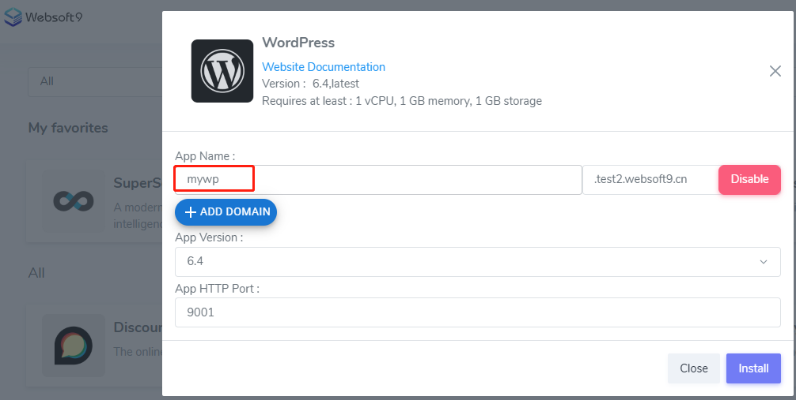
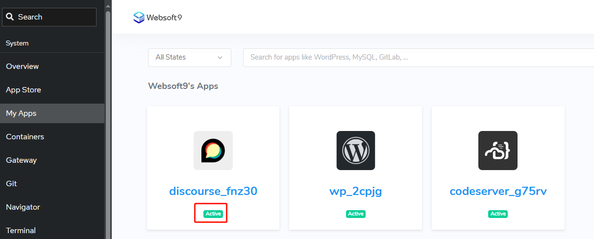

# 使用 Websoft9 部署应用

Websoft9 支持任何类型的应用部署方式：模板化自动化部署，Docker 镜像部署和源码部署等。   

## 特点

Websoft9 应用部署它与同类产品相比，极具创新性：   

- 遵循 **先安装，再配置** 的原则，实现极简安装的同时又开放给用户足够的可配置参数
- 支持泛解析的域名，一次绑定域名，每个应用都可以用，避免反复绑定域名的麻烦
- 兼容 **域名和端口** 两种常见的应用访问模式
- 应用的部署代码和数据文件分离
- 基于 [GitOps](./plan-git#gitops) 的技术哲学，保持应用的 **持续部署** 能力
- 支持自动化配置的 HTTPS 证书和自上传证书两种模式

总之，不具备技术背景的用户使用 Websoft9 部署应用毫无障碍，而开发者使用 Websoft9 拥有足够的权限和开放性体验。  

## 准备

- 若通过**域名访问**应用，需[准备域名](./domain-prepare)和[配置全局域名](./domain-set#global-domain)

- 若通过**端口访问**应用，需服务器的安全组入方向开放端口：9001-9999


## 从应用商店部署模板化应用{#appstore}

通过 Websoft9 **应用商店** 部署模板化的应用是最简单的部署方式，它支持 WordPress, ONLYOFFICE, Odoo, GitLab, Teamcity, AITable, MySQL, Moodle, Zentao 等 200+ 个热门应用。  

1. 登录 Websoft9 控制台，[搜索 Websoft9 模板化应用](./appstore.md)

1. 找到目标应用后，点击应用详情 "安装" 按钮

   

2. 填写或选择安装应用所需的参数：

   - 应用名称：建议填写为可识别的英文或拼音
   - 版本：自行选择，其中的 latest 版本可能不是稳定发行版
   - 端口：应用的外网访问端口，需同时在安全组中放开方可生效
   - 域名：若已提前[配置全局域名](./domain-set)此处会自动产生的子域名（可禁用），也支持额外增加域名

   


3. 点击 "安装" 按钮后，系统跳转到 **我的应用** 页面

4. 等待模板应用状态由 **Installing** 变成 **Active** 状态，则说明安装成功
   

## 从应用商店部署源码类应用{#runtime}

Websoft9 **应用商店** 内置 Java、Python、Node.js、PHP、Go、Ruby、HTML 和 .NET 等语言环境，用于源码部署应用程序。

使用参考：[基于程序环境部署应用](./runtime)

## 从应用商店部署镜像类应用{#image}

如果基于 Docker 镜像启动应用容器，先阅读[基本原理](./runtime/docker)，再参考如下的步骤：

1. Websoft9 **应用商店** 中进入 "运行环境" 下的 "Docker" 子类

2. 安装名称为 **Docker** 的应用   
   

3. 填写安装参数时，务必准确填写目标应用的容器端口（后续步骤被网关转发访问）

4. 待应用运行后，通过 [Docker 个性化编排](./runtime#dockercompose) 实现个性化镜像部署

## 手动在操作系统上部署应用{#os}

Websoft9 在设计的时候，充分考量了用户自主在服务器上直接部署应用的场景，建议的步骤：

1. 准备好与操作系统兼容的 [安装包（制品库）](./plan-package)

2. 编写部署脚本，部署时修正与 Websoft9 运行时产生的资源冲突

3. 通过端口测试应用程序

3. 使用 Websoft9 控制台的网关模块，为应用配置 **[Proxy 访问](./gateway-proxy)**。  


## 问题与故障

您在安装应用中可能会碰到各种问题，下面是常见的问题及说明：

#### 应用显示 Active 了，但访问 URL 报错？

应用 Active 表示对应的容器已经运行，但可能容器内服务的初始化（应用的自动安装向导）还没有完成，需等待 1-5 分钟后再试

#### 外网端口填写有什么建议吗？

建议填写 9001-9999 之间的端口号，便于必要时方便管理对应的安全组。  

#### 安装应用时，如何连接第三方的数据库？

目前不支持在安装时自定义数据库连接，但可以通过重建应用的方式实现

#### 同一个应用支持安装多个吗？

支持

#### 应用名称后面为什么加了一段字符？

这是应用的 ID 号，避免应用冲突

#### 有些应用安装过程很慢，甚至超时？

安装应用时会在线拉取远程的 Docker 镜像，如何带宽太小或网络状况太差的情况下，慢或超时时正常现象。  

#### 如何提前拉取应用的镜像？

运行下面的命令即可提前拉取镜像，以 WordPress 为例：

```
# 拷贝应用清单到服务器
docker cp websoft9-apphub:/websoft9/library  /path/applibary

# 查看应用名录
ls /path/applibary

# cd 到应用的目录
cd /path/applibary/wordpress

# 拉取镜像
docker compose pull 
```

#### 容器模块支持部署应用吗？

支持，但是这种部署方式有两个弊端：

- 非 GitOps 模式，无法持续部署
- 无法自动配置域名
- Websoft9 控制台无法管理它