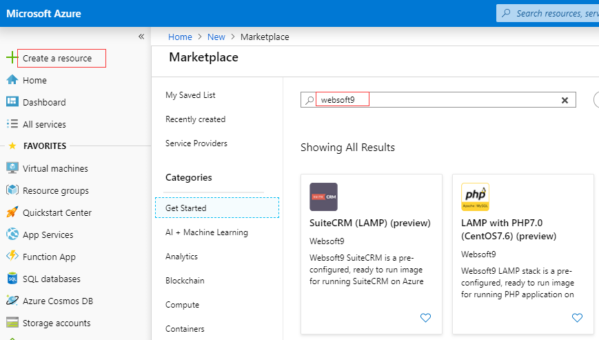
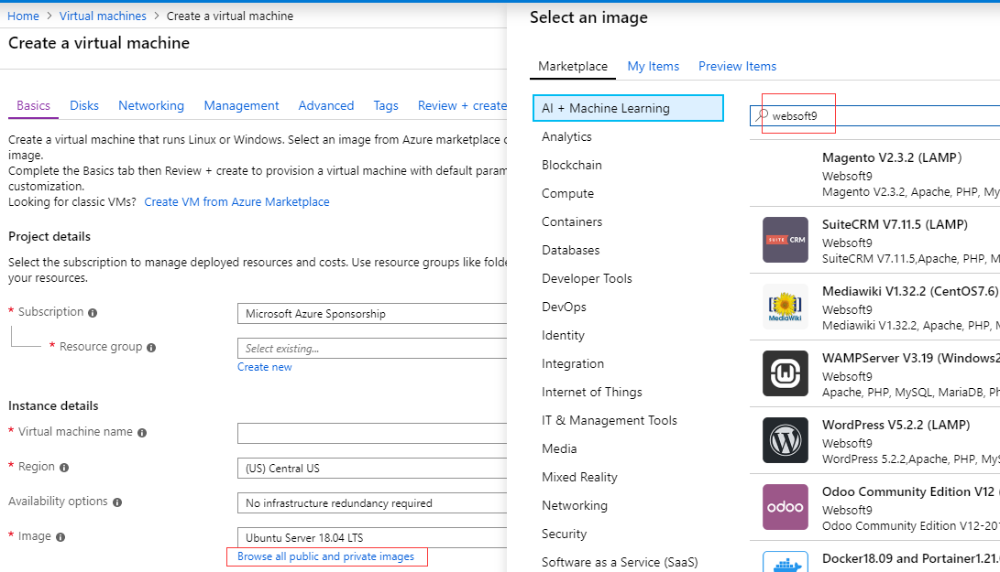

# Azure

For users of the Microsoft Azure business cloud, Websoft9 has a pre-configured offering in the [Azure Marketplace](https://azuremarketplace.microsoft.com/en-us/marketplace/apps?search=vmlab&page=1). This tutorial describes installing Websoft9 Enterprise Edition in a single Virtual Machine (VM).   

## Prerequisite

You need an account on Azure. Use of the following methods to obtain an account:

- If you or your company already have an account with a subscription, use that account. 
- If not, you can open your own [Azure account for free](https://azure.microsoft.com/en-us/free/). Azure’s free trial gives you $200 credit to explore Azure.

## Deploy Websoft9

Azure supports various ways to deploy Websoft9, essentially via VM image creation.   

Before deployment, you should understand VM [requirements](./requirements) first.      

Regardless of which deployment method you choose, Azure will initiate the deployment of a new VM.  

### From Azure Marketplace

1. Login to [Azure Marketplace](https://azuremarketplace.microsoft.com/en-us/marketplace/apps), input the key "websoft9" to search image of Websoft9
  

2. Select the target offer and click "GET IT NOW" button on product details page

3. Click "Create" button to create a VM with the image have selected

4. Complete VM creation and Websoft9 image subscription as instructed.

### From Azure Portal

Azure Portal provides two entry points for deploying offer based on image

  - **Portal > Create a resource**, search Websoft9 image and deploy it
    

  - **Portal > Visual Machines > + Add** to create VM, and select "websoft9" image for this VM
    


### From ARM templates

1. Prepare ARM template for Websoft9 deployment

2. Run this template

   - Login to Azure Console, load that ARM template and run it
   - Use Azure CLI/API to load that ARM template and run it

## After deployment

The deployment process will take a few minutes to complete. Once finished, you can:

1. View the details of the new EC2 through the Azure Portal
2. Run below command to set **root** account password
   ```
   sudo su
   passwd
   ```
3. [Login to Websoft9 Console](./login-console) and refer to [Post-Installation Setup](./install-setup) for next steps


## Troubleshoot

### VHD failed to create a VM?

**Description**: I use Websoft9 and deleted the VM and kept the VHD. Now, when I create a VM based on the VHD, it fails.  
**Solution**: This VHD contains a subscription relationship, but it cannot be passed to the Azure Portal  
**Solution**: You can create VM from Azure Resource Manager templates and add subscription item to that template  

1. Get the Run plan information by Azure CLI
    ```
    az vm image list --offer websoft9-enterpise --all --output table
   ```

2. Add item **plan** to template
    ```
      "plan": {
                 "name": "websoft9-enterpise",
                 "publisher": "websoft9inc",
                 "product": "websoft9"}
    ```